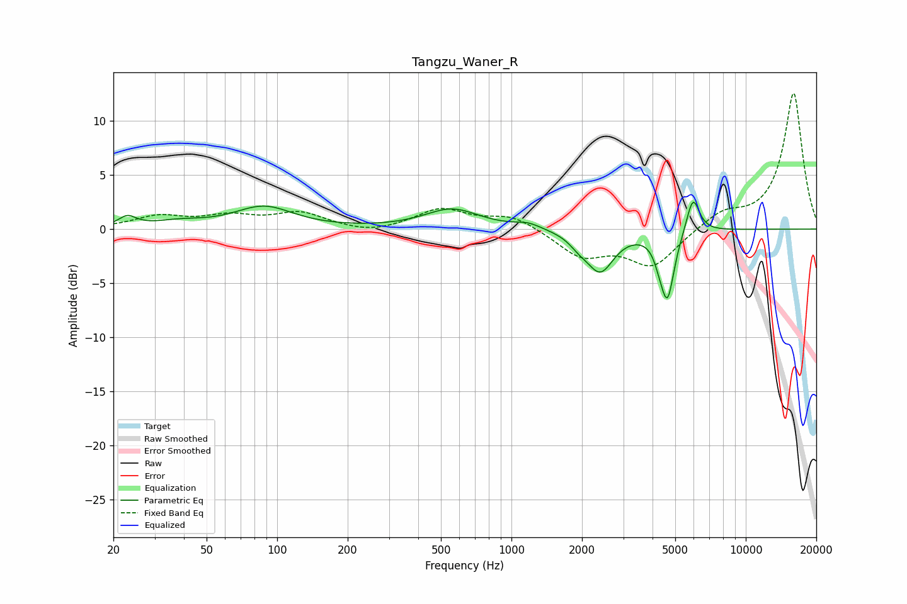

# Tangzu_Waner_R
See [usage instructions](https://github.com/jaakkopasanen/AutoEq#usage) for more options and info.

### Parametric EQs
Apply preamp of -2.6 dB when using parametric equalizer.

|   # | Type    |   Fc (Hz) |    Q |   Gain (dB) |
|-----|---------|-----------|------|-------------|
|   1 | Peaking |        23 | 3.8  |         1   |
|   2 | Peaking |        38 | 1.32 |         0.5 |
|   3 | Peaking |        88 | 1.14 |         2   |
|   4 | Peaking |       557 | 1.22 |         1.8 |
|   5 | Peaking |      1177 | 2.52 |         0.5 |
|   6 | Peaking |      1938 | 3.62 |        -0.7 |
|   7 | Peaking |      2391 | 2.42 |        -3.8 |
|   8 | Peaking |      4285 | 6    |        -1   |
|   9 | Peaking |      4636 | 4.88 |        -6   |
|  10 | Peaking |      5950 | 5.03 |         3.4 |

### Fixed Band EQs
When using fixed band (also called graphic) equalizer, apply preamp of **-12.6 dB** (if available) and set gains manually with these parameters.

|   # | Type    |   Fc (Hz) |    Q |   Gain (dB) |
|-----|---------|-----------|------|-------------|
|   1 | Peaking |        31 | 1.41 |         1.1 |
|   2 | Peaking |        62 | 1.41 |         1   |
|   3 | Peaking |       125 | 1.41 |         1.4 |
|   4 | Peaking |       250 | 1.41 |        -0.5 |
|   5 | Peaking |       500 | 1.41 |         1.8 |
|   6 | Peaking |      1000 | 1.41 |         1.2 |
|   7 | Peaking |      2000 | 1.41 |        -2.4 |
|   8 | Peaking |      4000 | 1.41 |        -3.4 |
|   9 | Peaking |      8000 | 1.41 |         1.4 |
|  10 | Peaking |     16000 | 1.41 |        12.6 |

### Graphs

