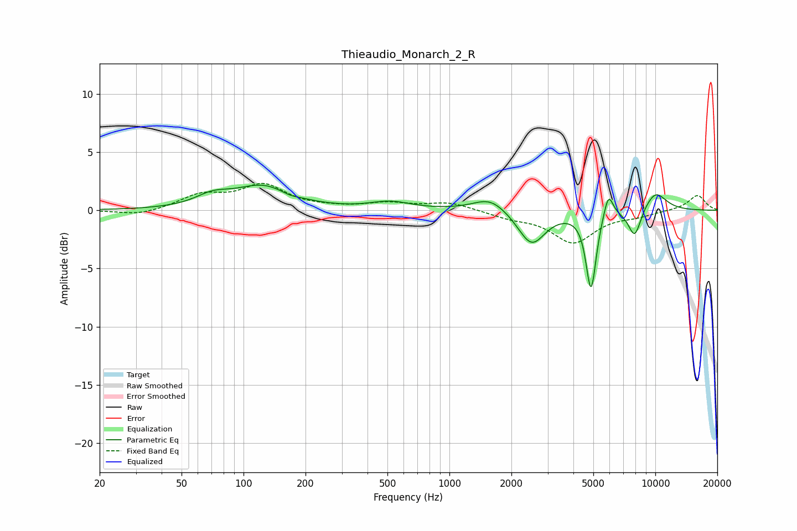

# Thieaudio_Monarch_2_R
See [usage instructions](https://github.com/jaakkopasanen/AutoEq#usage) for more options and info.

### Parametric EQs
Apply preamp of -2.3 dB when using parametric equalizer.

|   # | Type    |   Fc (Hz) |    Q |   Gain (dB) |
|-----|---------|-----------|------|-------------|
|   1 | Peaking |        71 | 1.72 |         0.9 |
|   2 | Peaking |       124 | 1.02 |         2   |
|   3 | Peaking |       167 | 3.2  |        -0.2 |
|   4 | Peaking |       517 | 1.46 |         0.7 |
|   5 | Peaking |      1579 | 1.73 |         1.2 |
|   6 | Peaking |      2505 | 2.14 |        -3   |
|   7 | Peaking |      4874 | 5.67 |        -6.7 |
|   8 | Peaking |      5918 | 5.96 |         2.1 |
|   9 | Peaking |      7942 | 4.18 |        -2.5 |
|  10 | Peaking |     10000 | 2.17 |         1.7 |

### Fixed Band EQs
When using fixed band (also called graphic) equalizer, apply preamp of **-2.4 dB** (if available) and set gains manually with these parameters.

|   # | Type    |   Fc (Hz) |    Q |   Gain (dB) |
|-----|---------|-----------|------|-------------|
|   1 | Peaking |        31 | 1.41 |        -0.5 |
|   2 | Peaking |        62 | 1.41 |         1.2 |
|   3 | Peaking |       125 | 1.41 |         2.1 |
|   4 | Peaking |       250 | 1.41 |         0.1 |
|   5 | Peaking |       500 | 1.41 |         0.6 |
|   6 | Peaking |      1000 | 1.41 |         0.7 |
|   7 | Peaking |      2000 | 1.41 |        -0.5 |
|   8 | Peaking |      4000 | 1.41 |        -2.7 |
|   9 | Peaking |      8000 | 1.41 |        -0.4 |
|  10 | Peaking |     16000 | 1.41 |         1.3 |

### Graphs

