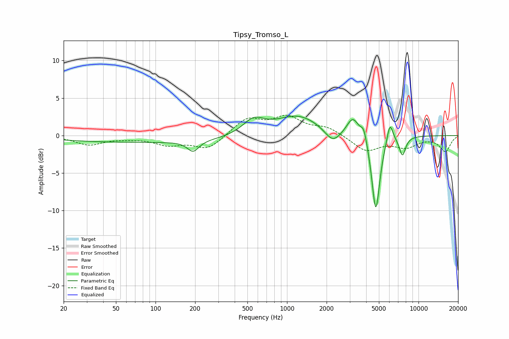

# Tipsy_Tromso_L
See [usage instructions](https://github.com/jaakkopasanen/AutoEq#usage) for more options and info.

### Parametric EQs
Apply preamp of -2.7 dB when using parametric equalizer.

|   # | Type    |   Fc (Hz) |    Q |   Gain (dB) |
|-----|---------|-----------|------|-------------|
|   1 | Peaking |        86 | 0.18 |        -0.9 |
|   2 | Peaking |       193 | 3.27 |        -1.5 |
|   3 | Peaking |       557 | 1.75 |         2   |
|   4 | Peaking |      1212 | 0.83 |         2.7 |
|   5 | Peaking |      2230 | 2.32 |        -1.9 |
|   6 | Peaking |      3170 | 3.04 |         2.5 |
|   7 | Peaking |      3840 | 6    |         1.7 |
|   8 | Peaking |      4734 | 4.47 |       -10.4 |
|   9 | Peaking |      6061 | 5.89 |         2.8 |
|  10 | Peaking |      7549 | 5.61 |        -2.5 |

### Fixed Band EQs
When using fixed band (also called graphic) equalizer, apply preamp of **-2.8 dB** (if available) and set gains manually with these parameters.

|   # | Type    |   Fc (Hz) |    Q |   Gain (dB) |
|-----|---------|-----------|------|-------------|
|   1 | Peaking |        31 | 1.41 |        -1.2 |
|   2 | Peaking |        62 | 1.41 |        -0.2 |
|   3 | Peaking |       125 | 1.41 |        -1.1 |
|   4 | Peaking |       250 | 1.41 |        -1.8 |
|   5 | Peaking |       500 | 1.41 |         2.2 |
|   6 | Peaking |      1000 | 1.41 |         2.3 |
|   7 | Peaking |      2000 | 1.41 |         1   |
|   8 | Peaking |      4000 | 1.41 |        -2   |
|   9 | Peaking |      8000 | 1.41 |        -1.4 |
|  10 | Peaking |     16000 | 1.41 |        -2.1 |

### Graphs

