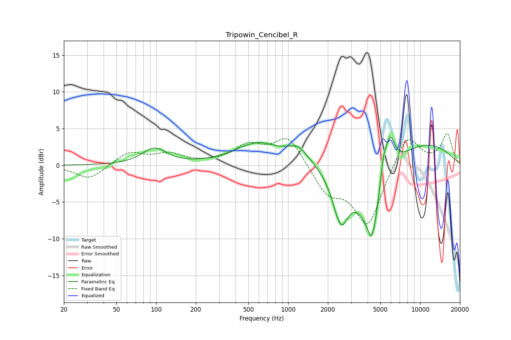

# Tripowin_Cencibel_R
See [usage instructions](https://github.com/jaakkopasanen/AutoEq#usage) for more options and info.

### Parametric EQs
Apply preamp of -4.0 dB when using parametric equalizer.

|   # | Type    |   Fc (Hz) |    Q |   Gain (dB) |
|-----|---------|-----------|------|-------------|
|   1 | Peaking |        97 | 1.54 |         2.2 |
|   2 | Peaking |       618 | 0.79 |         3.3 |
|   3 | Peaking |       750 | 1.26 |        -0.5 |
|   4 | Peaking |      1195 | 1.79 |         1.9 |
|   5 | Peaking |      2505 | 2.35 |        -6.7 |
|   6 | Peaking |      4310 | 5.62 |        -2.3 |
|   7 | Peaking |      4334 | 1.42 |        -9.5 |
|   8 | Peaking |      5253 | 5.67 |         3.4 |
|   9 | Peaking |      5907 | 3.5  |         5.5 |
|  10 | Peaking |     10000 | 0.42 |         3.3 |

### Fixed Band EQs
When using fixed band (also called graphic) equalizer, apply preamp of **-4.4 dB** (if available) and set gains manually with these parameters.

|   # | Type    |   Fc (Hz) |    Q |   Gain (dB) |
|-----|---------|-----------|------|-------------|
|   1 | Peaking |        31 | 1.41 |        -2   |
|   2 | Peaking |        62 | 1.41 |         1.8 |
|   3 | Peaking |       125 | 1.41 |         1.4 |
|   4 | Peaking |       250 | 1.41 |         0.2 |
|   5 | Peaking |       500 | 1.41 |         2.5 |
|   6 | Peaking |      1000 | 1.41 |         4   |
|   7 | Peaking |      2000 | 1.41 |        -3.5 |
|   8 | Peaking |      4000 | 1.41 |        -8.2 |
|   9 | Peaking |      8000 | 1.41 |         4.5 |
|  10 | Peaking |     16000 | 1.41 |         4.2 |

### Graphs

