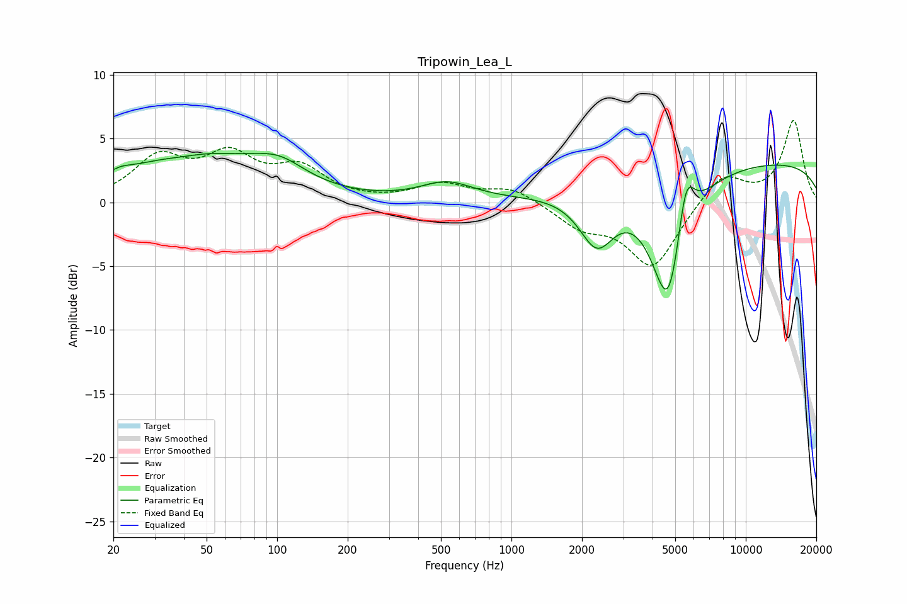

# Tripowin_Lea_L
See [usage instructions](https://github.com/jaakkopasanen/AutoEq#usage) for more options and info.

### Parametric EQs
Apply preamp of -3.9 dB when using parametric equalizer.

|   # | Type    |   Fc (Hz) |    Q |   Gain (dB) |
|-----|---------|-----------|------|-------------|
|   1 | Peaking |        21 | 2.03 |         0.4 |
|   2 | Peaking |        22 | 5.92 |         0.1 |
|   3 | Peaking |        40 | 1.62 |        -0.3 |
|   4 | Peaking |        44 | 0.49 |         3.7 |
|   5 | Peaking |       102 | 1.24 |         1.6 |
|   6 | Peaking |       530 | 1.25 |         1.4 |
|   7 | Peaking |      2316 | 1.87 |        -4.2 |
|   8 | Peaking |      4693 | 1.87 |       -10.8 |
|   9 | Peaking |      5538 | 3.64 |         5.1 |
|  10 | Peaking |     10000 | 0.18 |         3.3 |

### Fixed Band EQs
When using fixed band (also called graphic) equalizer, apply preamp of **-6.5 dB** (if available) and set gains manually with these parameters.

|   # | Type    |   Fc (Hz) |    Q |   Gain (dB) |
|-----|---------|-----------|------|-------------|
|   1 | Peaking |        31 | 1.41 |         3.3 |
|   2 | Peaking |        62 | 1.41 |         3.2 |
|   3 | Peaking |       125 | 1.41 |         2.4 |
|   4 | Peaking |       250 | 1.41 |        -0   |
|   5 | Peaking |       500 | 1.41 |         1.3 |
|   6 | Peaking |      1000 | 1.41 |         1.1 |
|   7 | Peaking |      2000 | 1.41 |        -1.7 |
|   8 | Peaking |      4000 | 1.41 |        -5.1 |
|   9 | Peaking |      8000 | 1.41 |         2.4 |
|  10 | Peaking |     16000 | 1.41 |         6.4 |

### Graphs

