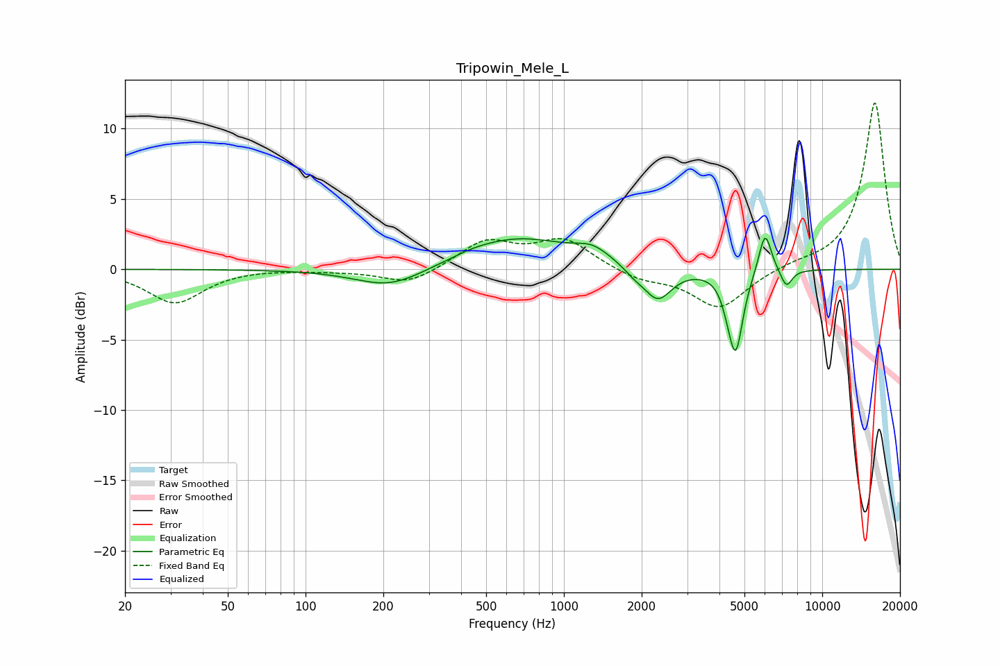

# Tripowin_Mele_L
See [usage instructions](https://github.com/jaakkopasanen/AutoEq#usage) for more options and info.

### Parametric EQs
Apply preamp of -2.3 dB when using parametric equalizer.

|   # | Type    |   Fc (Hz) |    Q |   Gain (dB) |
|-----|---------|-----------|------|-------------|
|   1 | Peaking |       212 | 1.06 |        -1.4 |
|   2 | Peaking |       444 | 1.73 |         0.2 |
|   3 | Peaking |       667 | 0.7  |         2.2 |
|   4 | Peaking |      1288 | 2.01 |         0.9 |
|   5 | Peaking |      1869 | 3.46 |        -0.5 |
|   6 | Peaking |      2308 | 2.59 |        -2.3 |
|   7 | Peaking |      4295 | 6    |        -0.7 |
|   8 | Peaking |      4625 | 5    |        -5.6 |
|   9 | Peaking |      6008 | 5.65 |         3   |
|  10 | Peaking |      7263 | 6    |        -1.3 |

### Fixed Band EQs
When using fixed band (also called graphic) equalizer, apply preamp of **-11.9 dB** (if available) and set gains manually with these parameters.

|   # | Type    |   Fc (Hz) |    Q |   Gain (dB) |
|-----|---------|-----------|------|-------------|
|   1 | Peaking |        31 | 1.41 |        -2.4 |
|   2 | Peaking |        62 | 1.41 |         0.1 |
|   3 | Peaking |       125 | 1.41 |        -0.1 |
|   4 | Peaking |       250 | 1.41 |        -1.1 |
|   5 | Peaking |       500 | 1.41 |         2   |
|   6 | Peaking |      1000 | 1.41 |         2   |
|   7 | Peaking |      2000 | 1.41 |        -0.7 |
|   8 | Peaking |      4000 | 1.41 |        -2.8 |
|   9 | Peaking |      8000 | 1.41 |         0.3 |
|  10 | Peaking |     16000 | 1.41 |        11.9 |

### Graphs

