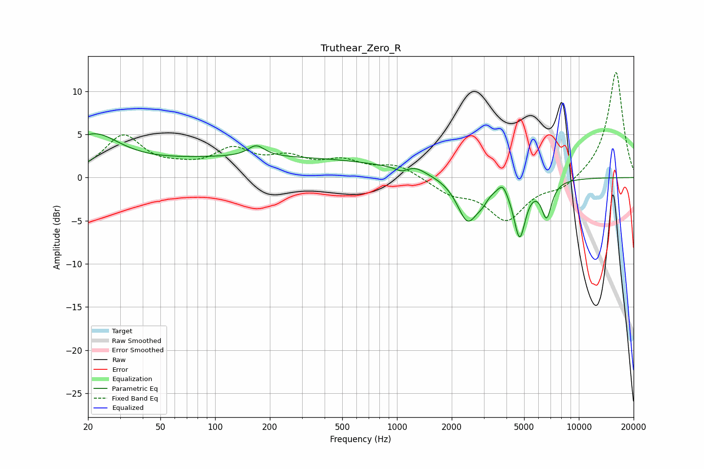

# Truthear_Zero_R
See [usage instructions](https://github.com/jaakkopasanen/AutoEq#usage) for more options and info.

### Parametric EQs
Apply preamp of -5.2 dB when using parametric equalizer.

|   # | Type    |   Fc (Hz) |    Q |   Gain (dB) |
|-----|---------|-----------|------|-------------|
|   1 | Peaking |        21 | 0.95 |         4.5 |
|   2 | Peaking |       168 | 3.11 |         1.3 |
|   3 | Peaking |       199 | 0.18 |         2.3 |
|   4 | Peaking |      1058 | 4.67 |        -0.4 |
|   5 | Peaking |      1271 | 2.87 |         0.6 |
|   6 | Peaking |      2447 | 2.44 |        -5.1 |
|   7 | Peaking |      2947 | 4.55 |        -0.9 |
|   8 | Peaking |      3812 | 6    |         1.1 |
|   9 | Peaking |      4726 | 4.27 |        -6.5 |
|  10 | Peaking |      6647 | 4.85 |        -4.1 |

### Fixed Band EQs
When using fixed band (also called graphic) equalizer, apply preamp of **-12.3 dB** (if available) and set gains manually with these parameters.

|   # | Type    |   Fc (Hz) |    Q |   Gain (dB) |
|-----|---------|-----------|------|-------------|
|   1 | Peaking |        31 | 1.41 |         4.7 |
|   2 | Peaking |        62 | 1.41 |         0.7 |
|   3 | Peaking |       125 | 1.41 |         2.9 |
|   4 | Peaking |       250 | 1.41 |         1.9 |
|   5 | Peaking |       500 | 1.41 |         1.6 |
|   6 | Peaking |      1000 | 1.41 |         1.4 |
|   7 | Peaking |      2000 | 1.41 |        -1.6 |
|   8 | Peaking |      4000 | 1.41 |        -4.7 |
|   9 | Peaking |      8000 | 1.41 |        -1.3 |
|  10 | Peaking |     16000 | 1.41 |        12.4 |

### Graphs

