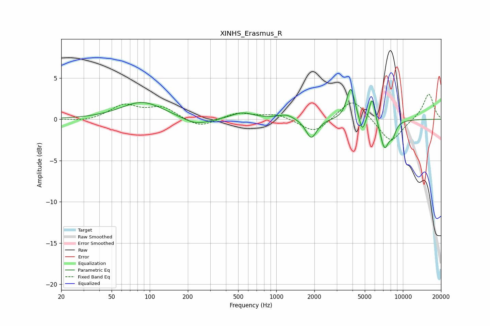

# XINHS_Erasmus_R
See [usage instructions](https://github.com/jaakkopasanen/AutoEq#usage) for more options and info.

### Parametric EQs
Apply preamp of -3.7 dB when using parametric equalizer.

|   # | Type    |   Fc (Hz) |    Q |   Gain (dB) |
|-----|---------|-----------|------|-------------|
|   1 | Peaking |        87 | 0.85 |         2.1 |
|   2 | Peaking |       233 | 1.35 |        -0.9 |
|   3 | Peaking |       541 | 1.63 |         0.8 |
|   4 | Peaking |      1200 | 2.2  |         0.6 |
|   5 | Peaking |      1890 | 3.32 |        -2.4 |
|   6 | Peaking |      3872 | 4.53 |         3.9 |
|   7 | Peaking |      4791 | 6    |        -1.9 |
|   8 | Peaking |      5721 | 5.9  |         3.1 |
|   9 | Peaking |      7160 | 3.89 |        -3.4 |
|  10 | Peaking |      8302 | 5.25 |        -1.4 |

### Fixed Band EQs
When using fixed band (also called graphic) equalizer, apply preamp of **-3.1 dB** (if available) and set gains manually with these parameters.

|   # | Type    |   Fc (Hz) |    Q |   Gain (dB) |
|-----|---------|-----------|------|-------------|
|   1 | Peaking |        31 | 1.41 |        -0.3 |
|   2 | Peaking |        62 | 1.41 |         1.7 |
|   3 | Peaking |       125 | 1.41 |         1.4 |
|   4 | Peaking |       250 | 1.41 |        -1.1 |
|   5 | Peaking |       500 | 1.41 |         0.8 |
|   6 | Peaking |      1000 | 1.41 |         0.6 |
|   7 | Peaking |      2000 | 1.41 |        -1.8 |
|   8 | Peaking |      4000 | 1.41 |         2.6 |
|   9 | Peaking |      8000 | 1.41 |        -2.9 |
|  10 | Peaking |     16000 | 1.41 |         3.2 |

### Graphs

