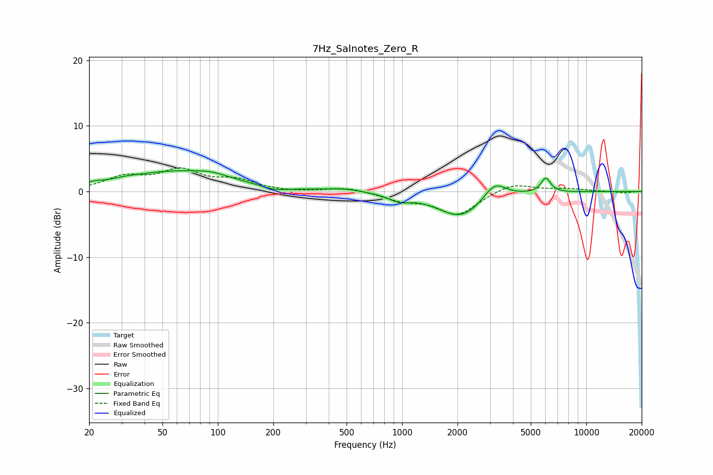

# 7Hz_Salnotes_Zero_R
See [usage instructions](https://github.com/jaakkopasanen/AutoEq#usage) for more options and info.

### Parametric EQs
Apply preamp of -3.3 dB when using parametric equalizer.

|   # | Type    |   Fc (Hz) |    Q |   Gain (dB) |
|-----|---------|-----------|------|-------------|
|   1 | Peaking |        21 | 3.92 |         0.3 |
|   2 | Peaking |        31 | 2.65 |         0.2 |
|   3 | Peaking |        59 | 0.48 |         3   |
|   4 | Peaking |        92 | 1.92 |         0.5 |
|   5 | Peaking |       203 | 2.08 |        -0.6 |
|   6 | Peaking |       481 | 1.57 |         0.4 |
|   7 | Peaking |       968 | 2.48 |        -1   |
|   8 | Peaking |      2092 | 1.11 |        -4   |
|   9 | Peaking |      3176 | 2.3  |         2.7 |
|  10 | Peaking |      6031 | 5.37 |         2.2 |

### Fixed Band EQs
When using fixed band (also called graphic) equalizer, apply preamp of **-3.7 dB** (if available) and set gains manually with these parameters.

|   # | Type    |   Fc (Hz) |    Q |   Gain (dB) |
|-----|---------|-----------|------|-------------|
|   1 | Peaking |        31 | 1.41 |         2   |
|   2 | Peaking |        62 | 1.41 |         3   |
|   3 | Peaking |       125 | 1.41 |         1.5 |
|   4 | Peaking |       250 | 1.41 |        -0.1 |
|   5 | Peaking |       500 | 1.41 |         0.6 |
|   6 | Peaking |      1000 | 1.41 |        -1.2 |
|   7 | Peaking |      2000 | 1.41 |        -3.5 |
|   8 | Peaking |      4000 | 1.41 |         1.4 |
|   9 | Peaking |      8000 | 1.41 |         0.4 |
|  10 | Peaking |     16000 | 1.41 |        -0.2 |

### Graphs

