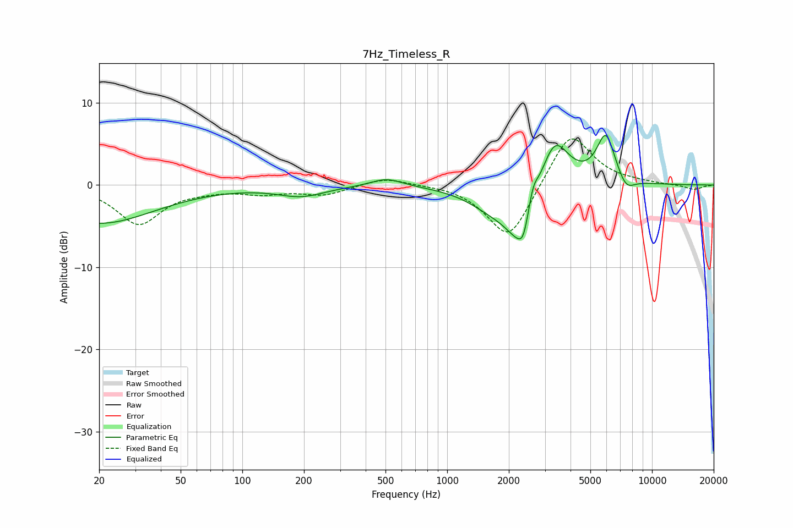

# 7Hz_Timeless_R
See [usage instructions](https://github.com/jaakkopasanen/AutoEq#usage) for more options and info.

### Parametric EQs
Apply preamp of -6.1 dB when using parametric equalizer.

|   # | Type    |   Fc (Hz) |    Q |   Gain (dB) |
|-----|---------|-----------|------|-------------|
|   1 | Peaking |        20 | 0.52 |        -4.6 |
|   2 | Peaking |       194 | 1.22 |        -1.3 |
|   3 | Peaking |       506 | 1.79 |         1   |
|   4 | Peaking |      1665 | 1.16 |        -2.3 |
|   5 | Peaking |      2282 | 1.93 |        -6.3 |
|   6 | Peaking |      2351 | 6    |        -1.7 |
|   7 | Peaking |      2622 | 6    |         2.4 |
|   8 | Peaking |      3330 | 1.96 |         6.6 |
|   9 | Peaking |      5952 | 3.01 |         5.9 |
|  10 | Peaking |      7471 | 3.29 |        -1.7 |

### Fixed Band EQs
When using fixed band (also called graphic) equalizer, apply preamp of **-5.7 dB** (if available) and set gains manually with these parameters.

|   # | Type    |   Fc (Hz) |    Q |   Gain (dB) |
|-----|---------|-----------|------|-------------|
|   1 | Peaking |        31 | 1.41 |        -4.7 |
|   2 | Peaking |        62 | 1.41 |        -0.4 |
|   3 | Peaking |       125 | 1.41 |        -0.9 |
|   4 | Peaking |       250 | 1.41 |        -1.1 |
|   5 | Peaking |       500 | 1.41 |         1   |
|   6 | Peaking |      1000 | 1.41 |         0.1 |
|   7 | Peaking |      2000 | 1.41 |        -6.9 |
|   8 | Peaking |      4000 | 1.41 |         6.8 |
|   9 | Peaking |      8000 | 1.41 |         0.2 |
|  10 | Peaking |     16000 | 1.41 |        -0.6 |

### Graphs

