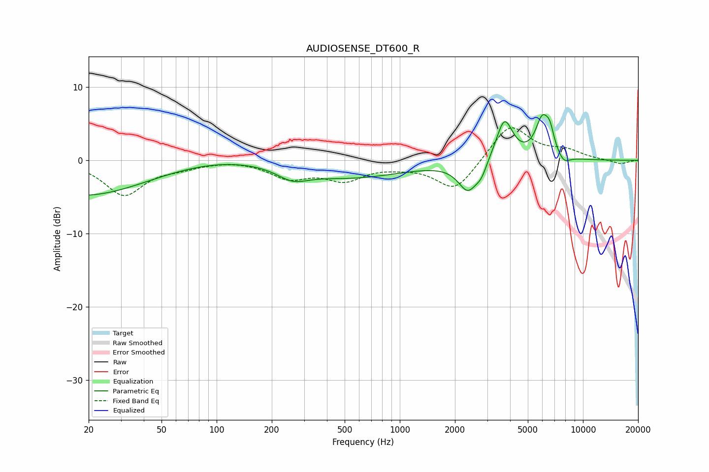

# AUDIOSENSE_DT600_R
See [usage instructions](https://github.com/jaakkopasanen/AutoEq#usage) for more options and info.

### Parametric EQs
Apply preamp of -6.3 dB when using parametric equalizer.

|   # | Type    |   Fc (Hz) |    Q |   Gain (dB) |
|-----|---------|-----------|------|-------------|
|   1 | Peaking |        20 | 0.38 |        -5.4 |
|   2 | Peaking |        67 | 0.29 |         1.2 |
|   3 | Peaking |       260 | 1.67 |        -1.6 |
|   4 | Peaking |       521 | 0.46 |        -2.4 |
|   5 | Peaking |      2359 | 2.64 |        -4   |
|   6 | Peaking |      2788 | 4.84 |        -1.4 |
|   7 | Peaking |      3724 | 3.06 |         5.8 |
|   8 | Peaking |      6001 | 3.62 |         5.2 |
|   9 | Peaking |      6604 | 5.97 |         2.3 |
|  10 | Peaking |      7868 | 4.15 |        -1.1 |

### Fixed Band EQs
When using fixed band (also called graphic) equalizer, apply preamp of **-4.5 dB** (if available) and set gains manually with these parameters.

|   # | Type    |   Fc (Hz) |    Q |   Gain (dB) |
|-----|---------|-----------|------|-------------|
|   1 | Peaking |        31 | 1.41 |        -4.7 |
|   2 | Peaking |        62 | 1.41 |        -0.7 |
|   3 | Peaking |       125 | 1.41 |         0.2 |
|   4 | Peaking |       250 | 1.41 |        -2.2 |
|   5 | Peaking |       500 | 1.41 |        -2.4 |
|   6 | Peaking |      1000 | 1.41 |        -0.5 |
|   7 | Peaking |      2000 | 1.41 |        -4.2 |
|   8 | Peaking |      4000 | 1.41 |         5   |
|   9 | Peaking |      8000 | 1.41 |         1.2 |
|  10 | Peaking |     16000 | 1.41 |        -0.5 |

### Graphs

