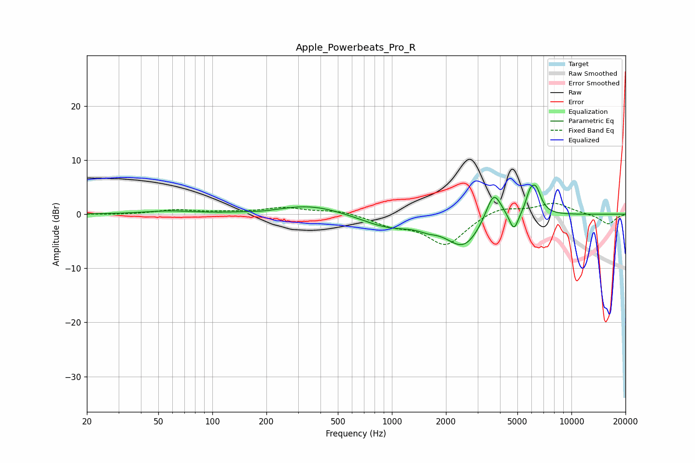

# Apple_Powerbeats_Pro_R
See [usage instructions](https://github.com/jaakkopasanen/AutoEq#usage) for more options and info.

### Parametric EQs
Apply preamp of -5.5 dB when using parametric equalizer.

|   # | Type    |   Fc (Hz) |    Q |   Gain (dB) |
|-----|---------|-----------|------|-------------|
|   1 | Peaking |        57 | 1.07 |         0.5 |
|   2 | Peaking |       195 | 2.16 |        -0.2 |
|   3 | Peaking |       354 | 0.79 |         1.8 |
|   4 | Peaking |       958 | 0.92 |        -2.3 |
|   5 | Peaking |      1580 | 2.82 |        -0.7 |
|   6 | Peaking |      2512 | 1.43 |        -5.9 |
|   7 | Peaking |      3687 | 3.13 |         5.9 |
|   8 | Peaking |      4780 | 5.57 |        -3.4 |
|   9 | Peaking |      5876 | 5.7  |         2.9 |
|  10 | Peaking |      6354 | 4.61 |         4.2 |

### Fixed Band EQs
When using fixed band (also called graphic) equalizer, apply preamp of **-2.1 dB** (if available) and set gains manually with these parameters.

|   # | Type    |   Fc (Hz) |    Q |   Gain (dB) |
|-----|---------|-----------|------|-------------|
|   1 | Peaking |        31 | 1.41 |        -0.1 |
|   2 | Peaking |        62 | 1.41 |         0.8 |
|   3 | Peaking |       125 | 1.41 |         0.3 |
|   4 | Peaking |       250 | 1.41 |         1.1 |
|   5 | Peaking |       500 | 1.41 |         0.7 |
|   6 | Peaking |      1000 | 1.41 |        -1.7 |
|   7 | Peaking |      2000 | 1.41 |        -5.6 |
|   8 | Peaking |      4000 | 1.41 |         1.5 |
|   9 | Peaking |      8000 | 1.41 |         2.1 |
|  10 | Peaking |     16000 | 1.41 |        -1.9 |

### Graphs

