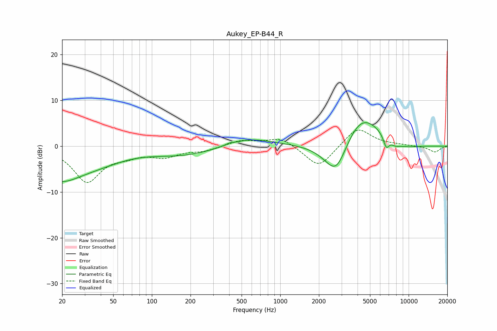

# Aukey_EP-B44_R
See [usage instructions](https://github.com/jaakkopasanen/AutoEq#usage) for more options and info.

### Parametric EQs
Apply preamp of -5.2 dB when using parametric equalizer.

|   # | Type    |   Fc (Hz) |    Q |   Gain (dB) |
|-----|---------|-----------|------|-------------|
|   1 | Peaking |        20 | 1.23 |        -1.9 |
|   2 | Peaking |        41 | 0.18 |        -7.5 |
|   3 | Peaking |        78 | 0.49 |         4.4 |
|   4 | Peaking |       401 | 5.73 |         0.3 |
|   5 | Peaking |       556 | 0.76 |         2.1 |
|   6 | Peaking |      2727 | 1.38 |        -9.6 |
|   7 | Peaking |      4192 | 0.84 |         8.9 |
|   8 | Peaking |      6696 | 5.92 |        -2.6 |
|   9 | Peaking |      7873 | 3.78 |        -0.8 |
|  10 | Peaking |      8724 | 0.96 |        -1.6 |

### Fixed Band EQs
When using fixed band (also called graphic) equalizer, apply preamp of **-3.6 dB** (if available) and set gains manually with these parameters.

|   # | Type    |   Fc (Hz) |    Q |   Gain (dB) |
|-----|---------|-----------|------|-------------|
|   1 | Peaking |        31 | 1.41 |        -7.6 |
|   2 | Peaking |        62 | 1.41 |        -1.4 |
|   3 | Peaking |       125 | 1.41 |        -2   |
|   4 | Peaking |       250 | 1.41 |        -0.9 |
|   5 | Peaking |       500 | 1.41 |         1.3 |
|   6 | Peaking |      1000 | 1.41 |         2   |
|   7 | Peaking |      2000 | 1.41 |        -4.9 |
|   8 | Peaking |      4000 | 1.41 |         4.3 |
|   9 | Peaking |      8000 | 1.41 |         0.2 |
|  10 | Peaking |     16000 | 1.41 |        -1.3 |

### Graphs

