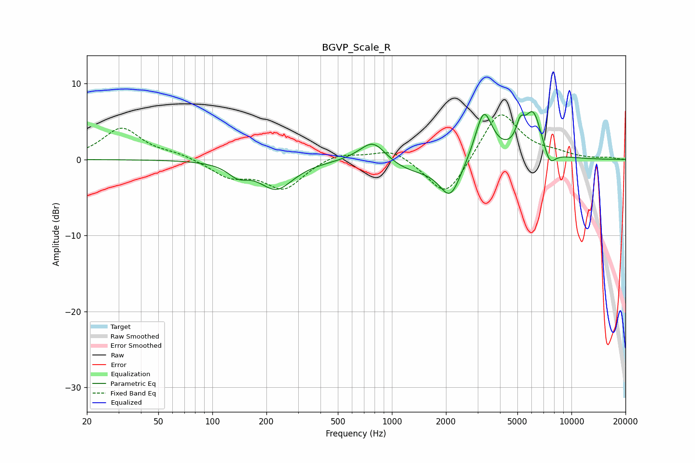

# BGVP_Scale_R
See [usage instructions](https://github.com/jaakkopasanen/AutoEq#usage) for more options and info.

### Parametric EQs
Apply preamp of -6.4 dB when using parametric equalizer.

|   # | Type    |   Fc (Hz) |    Q |   Gain (dB) |
|-----|---------|-----------|------|-------------|
|   1 | Peaking |       139 | 2.51 |        -1.5 |
|   2 | Peaking |       227 | 1.49 |        -3.8 |
|   3 | Peaking |       768 | 1.3  |         0.9 |
|   4 | Peaking |       788 | 1.99 |         2.4 |
|   5 | Peaking |      1224 | 0.79 |        -1.7 |
|   6 | Peaking |      2115 | 2.39 |        -4.7 |
|   7 | Peaking |      3246 | 2.89 |         6.7 |
|   8 | Peaking |      5190 | 6    |         2.4 |
|   9 | Peaking |      6121 | 2.73 |         6.1 |
|  10 | Peaking |      7545 | 4    |        -2.3 |

### Fixed Band EQs
When using fixed band (also called graphic) equalizer, apply preamp of **-6.0 dB** (if available) and set gains manually with these parameters.

|   # | Type    |   Fc (Hz) |    Q |   Gain (dB) |
|-----|---------|-----------|------|-------------|
|   1 | Peaking |        31 | 1.41 |         4.1 |
|   2 | Peaking |        62 | 1.41 |         0.7 |
|   3 | Peaking |       125 | 1.41 |        -2.1 |
|   4 | Peaking |       250 | 1.41 |        -3.8 |
|   5 | Peaking |       500 | 1.41 |         1   |
|   6 | Peaking |      1000 | 1.41 |         1.5 |
|   7 | Peaking |      2000 | 1.41 |        -5.4 |
|   8 | Peaking |      4000 | 1.41 |         6.7 |
|   9 | Peaking |      8000 | 1.41 |         0.6 |
|  10 | Peaking |     16000 | 1.41 |         0.2 |

### Graphs

