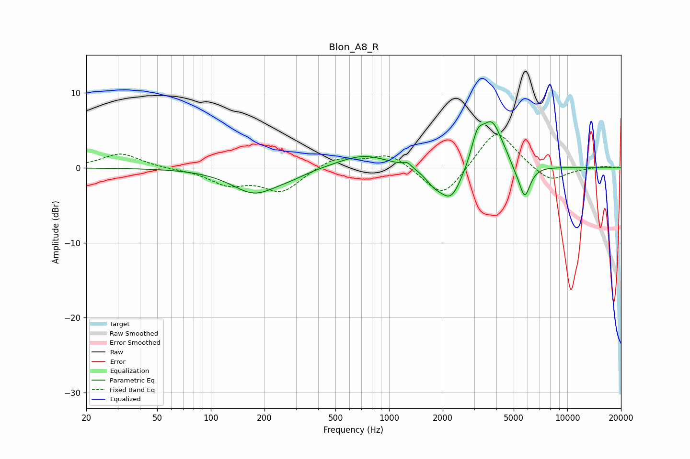

# Blon_A8_R
See [usage instructions](https://github.com/jaakkopasanen/AutoEq#usage) for more options and info.

### Parametric EQs
Apply preamp of -6.3 dB when using parametric equalizer.

|   # | Type    |   Fc (Hz) |    Q |   Gain (dB) |
|-----|---------|-----------|------|-------------|
|   1 | Peaking |       175 | 1.11 |        -3.3 |
|   2 | Peaking |       280 | 1.51 |        -0.6 |
|   3 | Peaking |       717 | 0.98 |         1.8 |
|   4 | Peaking |      1265 | 6    |         0.6 |
|   5 | Peaking |      1783 | 2.97 |        -1.3 |
|   6 | Peaking |      2227 | 2.19 |        -4.5 |
|   7 | Peaking |      3128 | 4.18 |         3.2 |
|   8 | Peaking |      3775 | 2.28 |         6.1 |
|   9 | Peaking |      5040 | 6    |        -0.6 |
|  10 | Peaking |      5757 | 4.28 |        -4.5 |

### Fixed Band EQs
When using fixed band (also called graphic) equalizer, apply preamp of **-4.5 dB** (if available) and set gains manually with these parameters.

|   # | Type    |   Fc (Hz) |    Q |   Gain (dB) |
|-----|---------|-----------|------|-------------|
|   1 | Peaking |        31 | 1.41 |         2   |
|   2 | Peaking |        62 | 1.41 |        -0.1 |
|   3 | Peaking |       125 | 1.41 |        -2   |
|   4 | Peaking |       250 | 1.41 |        -3.1 |
|   5 | Peaking |       500 | 1.41 |         1.5 |
|   6 | Peaking |      1000 | 1.41 |         2   |
|   7 | Peaking |      2000 | 1.41 |        -4.3 |
|   8 | Peaking |      4000 | 1.41 |         5.4 |
|   9 | Peaking |      8000 | 1.41 |        -2   |
|  10 | Peaking |     16000 | 1.41 |         0.2 |

### Graphs

