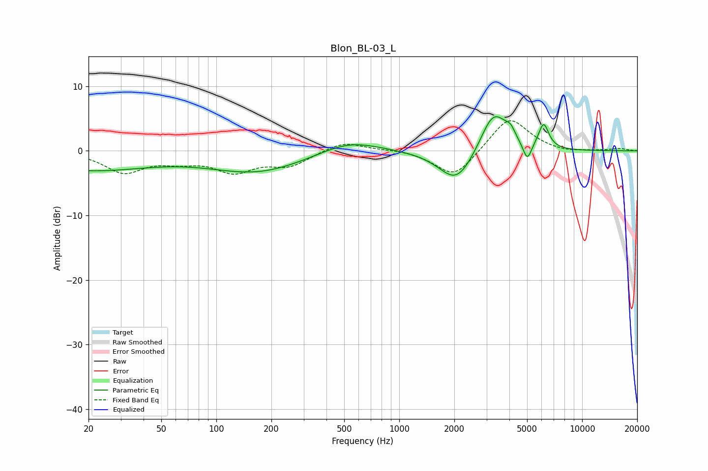

# Blon_BL-03_L
See [usage instructions](https://github.com/jaakkopasanen/AutoEq#usage) for more options and info.

### Parametric EQs
Apply preamp of -5.4 dB when using parametric equalizer.

|   # | Type    |   Fc (Hz) |    Q |   Gain (dB) |
|-----|---------|-----------|------|-------------|
|   1 | Peaking |        20 | 0.41 |        -2.9 |
|   2 | Peaking |       168 | 0.54 |        -3.2 |
|   3 | Peaking |       530 | 0.86 |         2   |
|   4 | Peaking |      2027 | 1.41 |        -0.6 |
|   5 | Peaking |      2059 | 1.5  |        -4.5 |
|   6 | Peaking |      3216 | 2.02 |         5.4 |
|   7 | Peaking |      3622 | 2.34 |         1.5 |
|   8 | Peaking |      4073 | 5.8  |         1.3 |
|   9 | Peaking |      5013 | 5.95 |        -2.8 |
|  10 | Peaking |      6156 | 4.85 |         3.9 |

### Fixed Band EQs
When using fixed band (also called graphic) equalizer, apply preamp of **-4.8 dB** (if available) and set gains manually with these parameters.

|   # | Type    |   Fc (Hz) |    Q |   Gain (dB) |
|-----|---------|-----------|------|-------------|
|   1 | Peaking |        31 | 1.41 |        -3.2 |
|   2 | Peaking |        62 | 1.41 |        -1.2 |
|   3 | Peaking |       125 | 1.41 |        -2.9 |
|   4 | Peaking |       250 | 1.41 |        -2.1 |
|   5 | Peaking |       500 | 1.41 |         1.5 |
|   6 | Peaking |      1000 | 1.41 |         0.3 |
|   7 | Peaking |      2000 | 1.41 |        -4.3 |
|   8 | Peaking |      4000 | 1.41 |         5.4 |
|   9 | Peaking |      8000 | 1.41 |        -0.4 |
|  10 | Peaking |     16000 | 1.41 |         0.3 |

### Graphs

