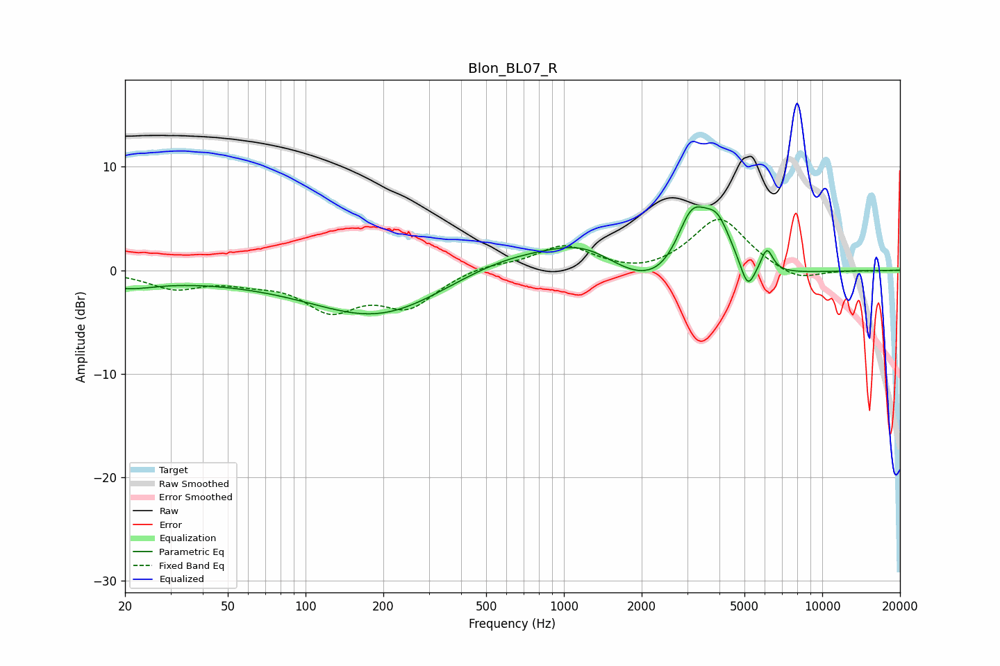

# Blon_BL07_R
See [usage instructions](https://github.com/jaakkopasanen/AutoEq#usage) for more options and info.

### Parametric EQs
Apply preamp of -6.2 dB when using parametric equalizer.

|   # | Type    |   Fc (Hz) |    Q |   Gain (dB) |
|-----|---------|-----------|------|-------------|
|   1 | Peaking |        20 | 1.27 |        -1.1 |
|   2 | Peaking |        88 | 0.19 |        -0.9 |
|   3 | Peaking |       195 | 0.57 |        -3.9 |
|   4 | Peaking |       619 | 0.61 |         2.1 |
|   5 | Peaking |      1222 | 0.98 |         2.7 |
|   6 | Peaking |      2507 | 0.63 |        -3.7 |
|   7 | Peaking |      3121 | 2.18 |         6.5 |
|   8 | Peaking |      3928 | 2.34 |         4.8 |
|   9 | Peaking |      5146 | 5.12 |        -2.6 |
|  10 | Peaking |      6109 | 6    |         2.3 |

### Fixed Band EQs
When using fixed band (also called graphic) equalizer, apply preamp of **-5.0 dB** (if available) and set gains manually with these parameters.

|   # | Type    |   Fc (Hz) |    Q |   Gain (dB) |
|-----|---------|-----------|------|-------------|
|   1 | Peaking |        31 | 1.41 |        -1.6 |
|   2 | Peaking |        62 | 1.41 |        -0.8 |
|   3 | Peaking |       125 | 1.41 |        -3.5 |
|   4 | Peaking |       250 | 1.41 |        -3.3 |
|   5 | Peaking |       500 | 1.41 |         0.6 |
|   6 | Peaking |      1000 | 1.41 |         2.3 |
|   7 | Peaking |      2000 | 1.41 |        -0.6 |
|   8 | Peaking |      4000 | 1.41 |         5.1 |
|   9 | Peaking |      8000 | 1.41 |        -1.2 |
|  10 | Peaking |     16000 | 1.41 |        -0.1 |

### Graphs

