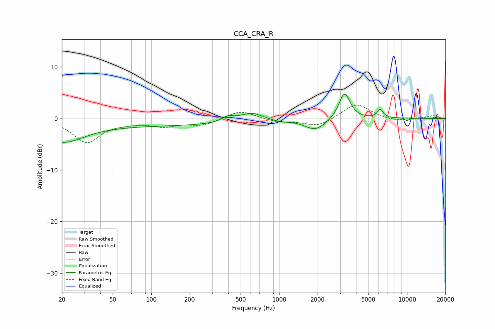

# CCA_CRA_R
See [usage instructions](https://github.com/jaakkopasanen/AutoEq#usage) for more options and info.

### Parametric EQs
Apply preamp of -4.8 dB when using parametric equalizer.

|   # | Type    |   Fc (Hz) |    Q |   Gain (dB) |
|-----|---------|-----------|------|-------------|
|   1 | Peaking |        20 | 0.84 |        -3.9 |
|   2 | Peaking |       110 | 0.18 |        -1.4 |
|   3 | Peaking |       398 | 3.09 |         1   |
|   4 | Peaking |       608 | 1.51 |         1.7 |
|   5 | Peaking |      1003 | 1.79 |        -0.4 |
|   6 | Peaking |      1926 | 1.69 |        -2.2 |
|   7 | Peaking |      3241 | 3.28 |         5.2 |
|   8 | Peaking |      6177 | 6    |         1.6 |
|   9 | Peaking |     10000 | 2.82 |         0.4 |
|  10 | Peaking |     10000 | 5.95 |        -0.8 |

### Fixed Band EQs
When using fixed band (also called graphic) equalizer, apply preamp of **-2.7 dB** (if available) and set gains manually with these parameters.

|   # | Type    |   Fc (Hz) |    Q |   Gain (dB) |
|-----|---------|-----------|------|-------------|
|   1 | Peaking |        31 | 1.41 |        -4.5 |
|   2 | Peaking |        62 | 1.41 |        -0.5 |
|   3 | Peaking |       125 | 1.41 |        -1.3 |
|   4 | Peaking |       250 | 1.41 |        -1.2 |
|   5 | Peaking |       500 | 1.41 |         1.6 |
|   6 | Peaking |      1000 | 1.41 |        -0.7 |
|   7 | Peaking |      2000 | 1.41 |        -1.6 |
|   8 | Peaking |      4000 | 1.41 |         3   |
|   9 | Peaking |      8000 | 1.41 |        -0.5 |
|  10 | Peaking |     16000 | 1.41 |         0.5 |

### Graphs

