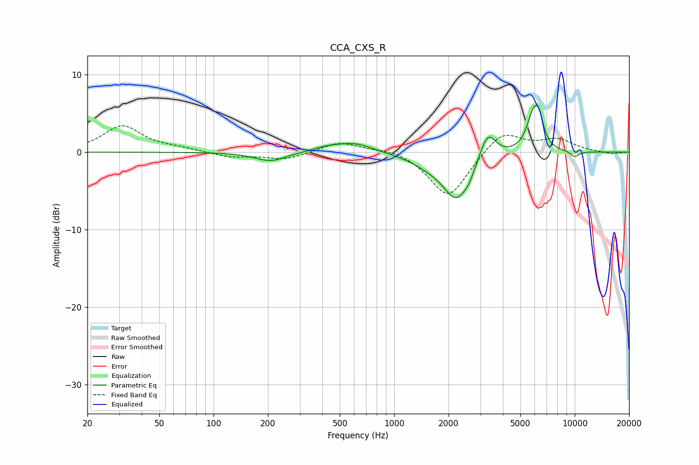

# CCA_CXS_R
See [usage instructions](https://github.com/jaakkopasanen/AutoEq#usage) for more options and info.

### Parametric EQs
Apply preamp of -6.1 dB when using parametric equalizer.

|   # | Type    |   Fc (Hz) |    Q |   Gain (dB) |
|-----|---------|-----------|------|-------------|
|   1 | Peaking |       206 | 1.64 |        -1.2 |
|   2 | Peaking |       422 | 1.82 |         0.5 |
|   3 | Peaking |       602 | 1.36 |         1.2 |
|   4 | Peaking |      1557 | 1.33 |        -1.1 |
|   5 | Peaking |      2215 | 1.9  |        -5.6 |
|   6 | Peaking |      2601 | 5.25 |        -0.8 |
|   7 | Peaking |      3299 | 3.24 |         3.5 |
|   8 | Peaking |      5898 | 3.82 |         4.5 |
|   9 | Peaking |      6356 | 5.75 |         2.6 |
|  10 | Peaking |     10000 | 5.09 |        -0.7 |

### Fixed Band EQs
When using fixed band (also called graphic) equalizer, apply preamp of **-3.5 dB** (if available) and set gains manually with these parameters.

|   # | Type    |   Fc (Hz) |    Q |   Gain (dB) |
|-----|---------|-----------|------|-------------|
|   1 | Peaking |        31 | 1.41 |         3.4 |
|   2 | Peaking |        62 | 1.41 |         0.4 |
|   3 | Peaking |       125 | 1.41 |        -0.6 |
|   4 | Peaking |       250 | 1.41 |        -1   |
|   5 | Peaking |       500 | 1.41 |         1.4 |
|   6 | Peaking |      1000 | 1.41 |         0.6 |
|   7 | Peaking |      2000 | 1.41 |        -6   |
|   8 | Peaking |      4000 | 1.41 |         2.9 |
|   9 | Peaking |      8000 | 1.41 |         1.6 |
|  10 | Peaking |     16000 | 1.41 |        -0.3 |

### Graphs

