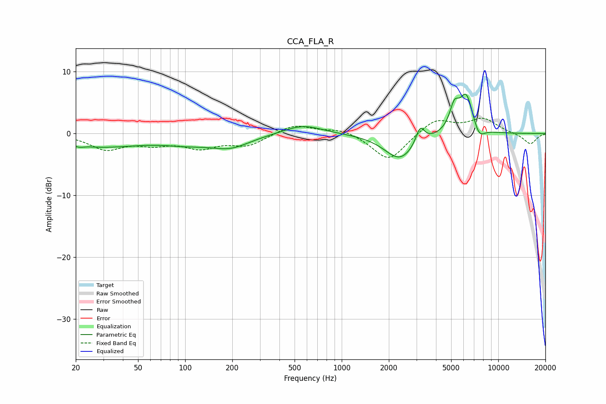

# CCA_FLA_R
See [usage instructions](https://github.com/jaakkopasanen/AutoEq#usage) for more options and info.

### Parametric EQs
Apply preamp of -6.5 dB when using parametric equalizer.

|   # | Type    |   Fc (Hz) |    Q |   Gain (dB) |
|-----|---------|-----------|------|-------------|
|   1 | Peaking |        21 | 5.37 |        -0.3 |
|   2 | Peaking |        29 | 0.51 |        -2   |
|   3 | Peaking |       102 | 0.91 |        -1.1 |
|   4 | Peaking |       194 | 1.1  |        -2   |
|   5 | Peaking |       565 | 1.16 |         1.5 |
|   6 | Peaking |      2356 | 1.42 |        -4.2 |
|   7 | Peaking |      3173 | 5.12 |         2.8 |
|   8 | Peaking |      5236 | 4.59 |         3.5 |
|   9 | Peaking |      6247 | 3.04 |         6.3 |
|  10 | Peaking |      7519 | 3.71 |        -2.1 |

### Fixed Band EQs
When using fixed band (also called graphic) equalizer, apply preamp of **-2.6 dB** (if available) and set gains manually with these parameters.

|   # | Type    |   Fc (Hz) |    Q |   Gain (dB) |
|-----|---------|-----------|------|-------------|
|   1 | Peaking |        31 | 1.41 |        -2.4 |
|   2 | Peaking |        62 | 1.41 |        -1.4 |
|   3 | Peaking |       125 | 1.41 |        -2   |
|   4 | Peaking |       250 | 1.41 |        -1.8 |
|   5 | Peaking |       500 | 1.41 |         1.5 |
|   6 | Peaking |      1000 | 1.41 |         0.9 |
|   7 | Peaking |      2000 | 1.41 |        -4.5 |
|   8 | Peaking |      4000 | 1.41 |         2.4 |
|   9 | Peaking |      8000 | 1.41 |         2.3 |
|  10 | Peaking |     16000 | 1.41 |        -1.7 |

### Graphs

