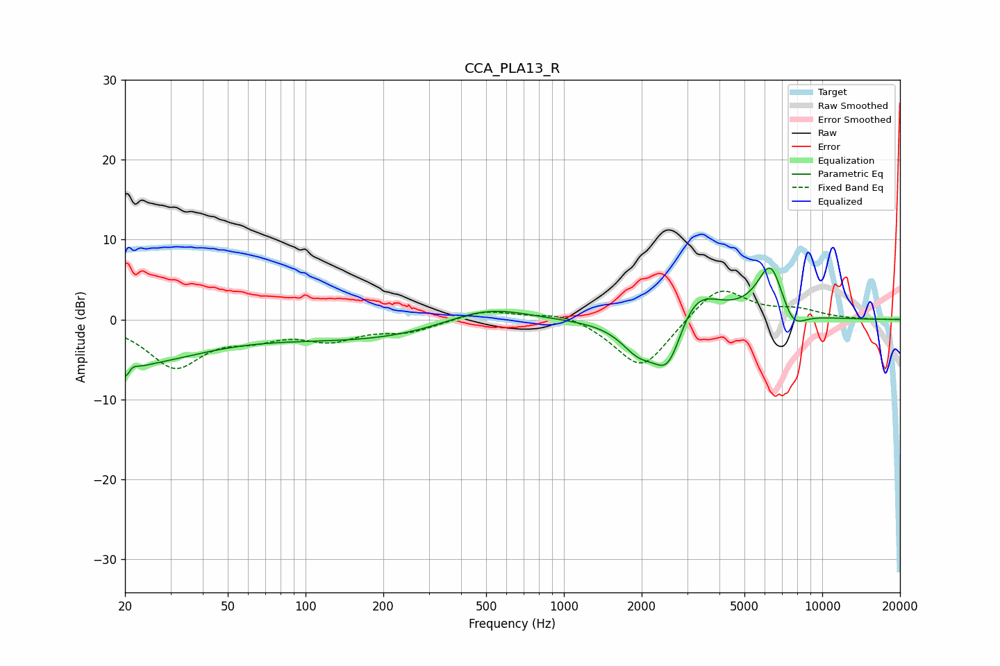

# CCA_PLA13_R
See [usage instructions](https://github.com/jaakkopasanen/AutoEq#usage) for more options and info.

### Parametric EQs
Apply preamp of -6.6 dB when using parametric equalizer.

|   # | Type    |   Fc (Hz) |    Q |   Gain (dB) |
|-----|---------|-----------|------|-------------|
|   1 | Peaking |        20 | 4.67 |        -4.5 |
|   2 | Peaking |        21 | 5.8  |         3.2 |
|   3 | Peaking |        22 | 0.53 |        -5   |
|   4 | Peaking |       218 | 0.31 |        -2.7 |
|   5 | Peaking |       499 | 0.78 |         3.1 |
|   6 | Peaking |      1947 | 1.99 |        -3.5 |
|   7 | Peaking |      2539 | 2.29 |        -7.3 |
|   8 | Peaking |      3172 | 1.52 |         5.2 |
|   9 | Peaking |      6317 | 2.59 |         7.1 |
|  10 | Peaking |      7675 | 2.77 |        -2.8 |

### Fixed Band EQs
When using fixed band (also called graphic) equalizer, apply preamp of **-3.6 dB** (if available) and set gains manually with these parameters.

|   # | Type    |   Fc (Hz) |    Q |   Gain (dB) |
|-----|---------|-----------|------|-------------|
|   1 | Peaking |        31 | 1.41 |        -5.7 |
|   2 | Peaking |        62 | 1.41 |        -1.7 |
|   3 | Peaking |       125 | 1.41 |        -2.2 |
|   4 | Peaking |       250 | 1.41 |        -1.4 |
|   5 | Peaking |       500 | 1.41 |         1.3 |
|   6 | Peaking |      1000 | 1.41 |         1.1 |
|   7 | Peaking |      2000 | 1.41 |        -6.5 |
|   8 | Peaking |      4000 | 1.41 |         4.5 |
|   9 | Peaking |      8000 | 1.41 |         1.1 |
|  10 | Peaking |     16000 | 1.41 |        -0   |

### Graphs

