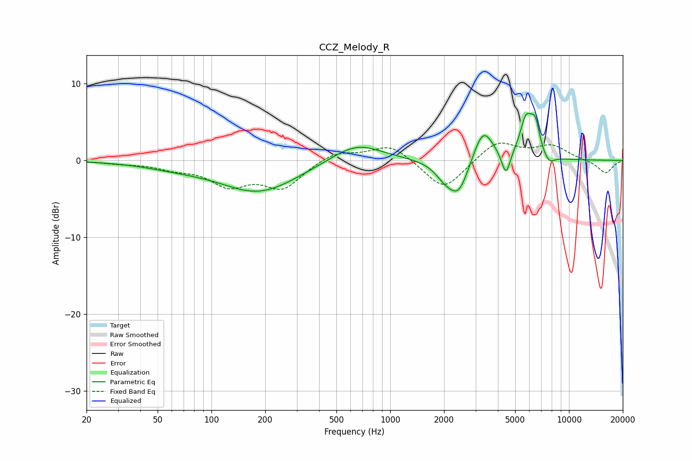

# CCZ_Melody_R
See [usage instructions](https://github.com/jaakkopasanen/AutoEq#usage) for more options and info.

### Parametric EQs
Apply preamp of -6.2 dB when using parametric equalizer.

|   # | Type    |   Fc (Hz) |    Q |   Gain (dB) |
|-----|---------|-----------|------|-------------|
|   1 | Peaking |        63 | 0.74 |        -0.6 |
|   2 | Peaking |       185 | 0.66 |        -4.1 |
|   3 | Peaking |       647 | 1    |         2.5 |
|   4 | Peaking |      2008 | 2.62 |        -1.5 |
|   5 | Peaking |      2411 | 2.43 |        -4.4 |
|   6 | Peaking |      3309 | 2.52 |         4.5 |
|   7 | Peaking |      4442 | 5.85 |        -3.2 |
|   8 | Peaking |      5767 | 3.86 |         5   |
|   9 | Peaking |      6485 | 5.39 |         3.5 |
|  10 | Peaking |      7700 | 4.22 |        -1.2 |

### Fixed Band EQs
When using fixed band (also called graphic) equalizer, apply preamp of **-2.3 dB** (if available) and set gains manually with these parameters.

|   # | Type    |   Fc (Hz) |    Q |   Gain (dB) |
|-----|---------|-----------|------|-------------|
|   1 | Peaking |        31 | 1.41 |        -0.3 |
|   2 | Peaking |        62 | 1.41 |        -0.9 |
|   3 | Peaking |       125 | 1.41 |        -3   |
|   4 | Peaking |       250 | 1.41 |        -3.4 |
|   5 | Peaking |       500 | 1.41 |         1.2 |
|   6 | Peaking |      1000 | 1.41 |         2.1 |
|   7 | Peaking |      2000 | 1.41 |        -4   |
|   8 | Peaking |      4000 | 1.41 |         2.6 |
|   9 | Peaking |      8000 | 1.41 |         1.8 |
|  10 | Peaking |     16000 | 1.41 |        -1.7 |

### Graphs

