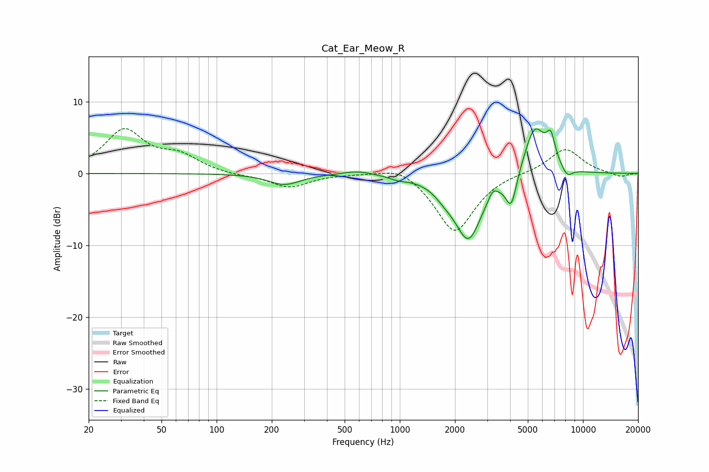

# Cat_Ear_Meow_R
See [usage instructions](https://github.com/jaakkopasanen/AutoEq#usage) for more options and info.

### Parametric EQs
Apply preamp of -6.3 dB when using parametric equalizer.

|   # | Type    |   Fc (Hz) |    Q |   Gain (dB) |
|-----|---------|-----------|------|-------------|
|   1 | Peaking |       235 | 1.62 |        -1.5 |
|   2 | Peaking |       590 | 1.69 |         0.6 |
|   3 | Peaking |       982 | 2.97 |        -0.4 |
|   4 | Peaking |      1762 | 2.61 |        -1   |
|   5 | Peaking |      2368 | 1.84 |        -9   |
|   6 | Peaking |      3216 | 5.71 |         1.2 |
|   7 | Peaking |      4060 | 4.58 |        -4.7 |
|   8 | Peaking |      5454 | 2.31 |         6.9 |
|   9 | Peaking |      6675 | 5.57 |         3.5 |
|  10 | Peaking |      8212 | 4.56 |        -1.3 |

### Fixed Band EQs
When using fixed band (also called graphic) equalizer, apply preamp of **-6.3 dB** (if available) and set gains manually with these parameters.

|   # | Type    |   Fc (Hz) |    Q |   Gain (dB) |
|-----|---------|-----------|------|-------------|
|   1 | Peaking |        31 | 1.41 |         5.9 |
|   2 | Peaking |        62 | 1.41 |         2.1 |
|   3 | Peaking |       125 | 1.41 |        -0.3 |
|   4 | Peaking |       250 | 1.41 |        -1.9 |
|   5 | Peaking |       500 | 1.41 |         0   |
|   6 | Peaking |      1000 | 1.41 |         1.4 |
|   7 | Peaking |      2000 | 1.41 |        -8.3 |
|   8 | Peaking |      4000 | 1.41 |         0.2 |
|   9 | Peaking |      8000 | 1.41 |         3.5 |
|  10 | Peaking |     16000 | 1.41 |        -0.5 |

### Graphs

