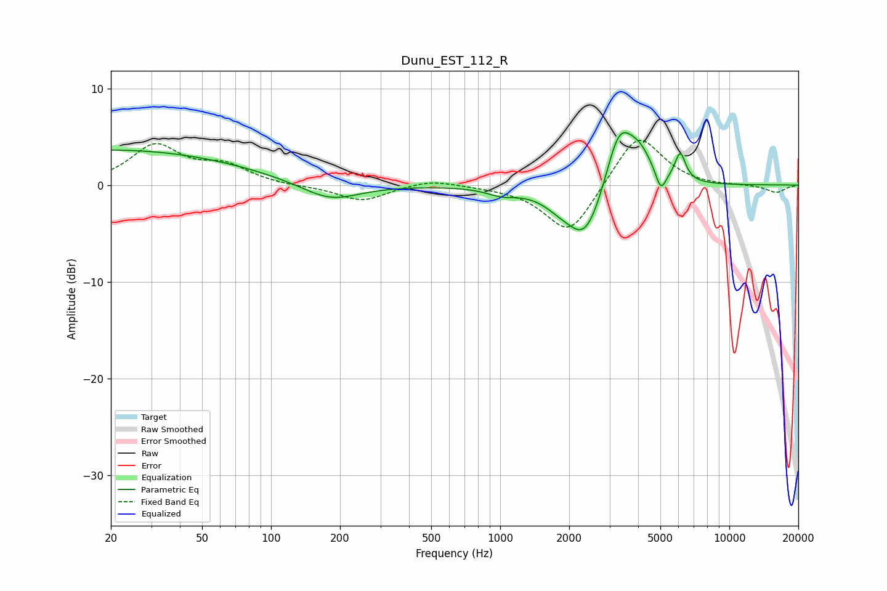

# Dunu_EST_112_R
See [usage instructions](https://github.com/jaakkopasanen/AutoEq#usage) for more options and info.

### Parametric EQs
Apply preamp of -5.5 dB when using parametric equalizer.

|   # | Type    |   Fc (Hz) |    Q |   Gain (dB) |
|-----|---------|-----------|------|-------------|
|   1 | Peaking |        20 | 0.24 |         3.6 |
|   2 | Peaking |       181 | 1.11 |        -1.9 |
|   3 | Peaking |      1013 | 2.24 |        -0.7 |
|   4 | Peaking |      1809 | 2.25 |        -0.7 |
|   5 | Peaking |      2316 | 2.34 |        -2   |
|   6 | Peaking |      2442 | 1.31 |        -4.6 |
|   7 | Peaking |      3292 | 2.17 |         7   |
|   8 | Peaking |      4062 | 2.3  |         2.7 |
|   9 | Peaking |      5022 | 5.99 |        -2.2 |
|  10 | Peaking |      6107 | 5.89 |         2.9 |

### Fixed Band EQs
When using fixed band (also called graphic) equalizer, apply preamp of **-4.7 dB** (if available) and set gains manually with these parameters.

|   # | Type    |   Fc (Hz) |    Q |   Gain (dB) |
|-----|---------|-----------|------|-------------|
|   1 | Peaking |        31 | 1.41 |         4   |
|   2 | Peaking |        62 | 1.41 |         1.8 |
|   3 | Peaking |       125 | 1.41 |        -0.1 |
|   4 | Peaking |       250 | 1.41 |        -1.6 |
|   5 | Peaking |       500 | 1.41 |         0.6 |
|   6 | Peaking |      1000 | 1.41 |        -0.1 |
|   7 | Peaking |      2000 | 1.41 |        -5.3 |
|   8 | Peaking |      4000 | 1.41 |         5.6 |
|   9 | Peaking |      8000 | 1.41 |        -0.1 |
|  10 | Peaking |     16000 | 1.41 |        -0.8 |

### Graphs

