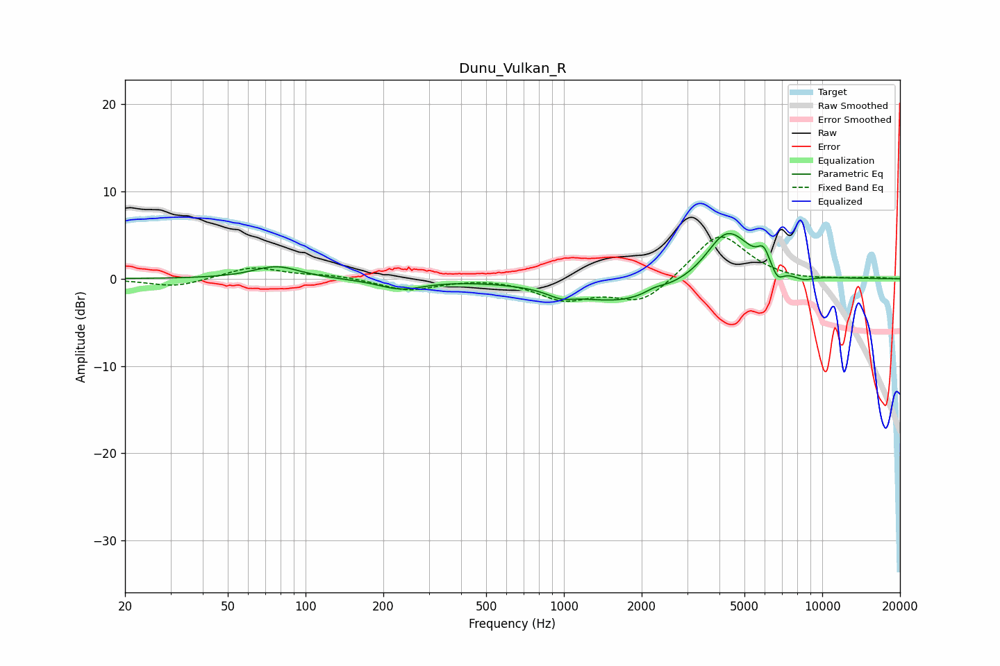

# Dunu_Vulkan_R
See [usage instructions](https://github.com/jaakkopasanen/AutoEq#usage) for more options and info.

### Parametric EQs
Apply preamp of -5.3 dB when using parametric equalizer.

|   # | Type    |   Fc (Hz) |    Q |   Gain (dB) |
|-----|---------|-----------|------|-------------|
|   1 | Peaking |        77 | 1.58 |         1.4 |
|   2 | Peaking |       234 | 1.6  |        -1.1 |
|   3 | Peaking |       973 | 2.88 |        -0.7 |
|   4 | Peaking |      1684 | 0.7  |        -2.8 |
|   5 | Peaking |      2256 | 3.56 |         0.5 |
|   6 | Peaking |      4009 | 2.6  |         0.8 |
|   7 | Peaking |      4403 | 1.59 |         5.2 |
|   8 | Peaking |      5930 | 6    |         1.9 |
|   9 | Peaking |      6725 | 6    |        -1.3 |
|  10 | Peaking |      8442 | 3.19 |        -0.6 |

### Fixed Band EQs
When using fixed band (also called graphic) equalizer, apply preamp of **-4.9 dB** (if available) and set gains manually with these parameters.

|   # | Type    |   Fc (Hz) |    Q |   Gain (dB) |
|-----|---------|-----------|------|-------------|
|   1 | Peaking |        31 | 1.41 |        -1   |
|   2 | Peaking |        62 | 1.41 |         1.4 |
|   3 | Peaking |       125 | 1.41 |         0.4 |
|   4 | Peaking |       250 | 1.41 |        -1.3 |
|   5 | Peaking |       500 | 1.41 |         0.2 |
|   6 | Peaking |      1000 | 1.41 |        -2.2 |
|   7 | Peaking |      2000 | 1.41 |        -2.8 |
|   8 | Peaking |      4000 | 1.41 |         5.4 |
|   9 | Peaking |      8000 | 1.41 |        -0.3 |
|  10 | Peaking |     16000 | 1.41 |         0.1 |

### Graphs

