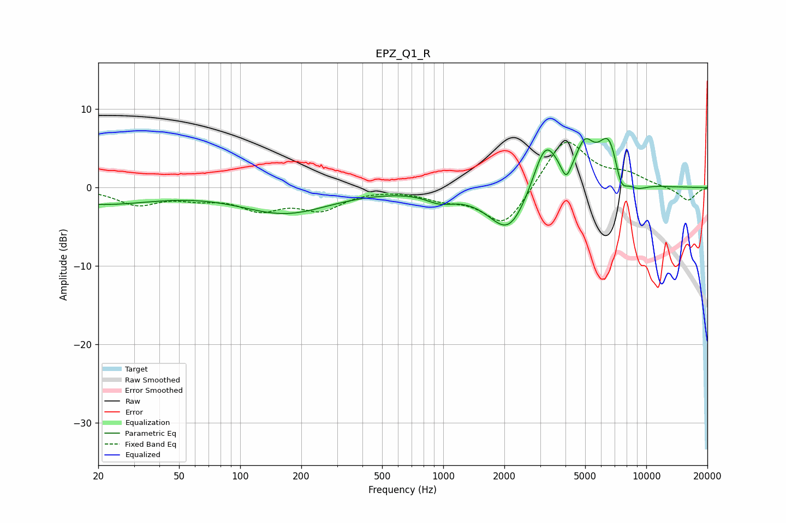

# EPZ_Q1_R
See [usage instructions](https://github.com/jaakkopasanen/AutoEq#usage) for more options and info.

### Parametric EQs
Apply preamp of -6.4 dB when using parametric equalizer.

|   # | Type    |   Fc (Hz) |    Q |   Gain (dB) |
|-----|---------|-----------|------|-------------|
|   1 | Peaking |        20 | 0.5  |        -2   |
|   2 | Peaking |       167 | 0.64 |        -3.2 |
|   3 | Peaking |       964 | 2    |        -1.2 |
|   4 | Peaking |      2106 | 1.41 |        -6.1 |
|   5 | Peaking |      3184 | 2.23 |         6.7 |
|   6 | Peaking |      4033 | 6    |        -2.2 |
|   7 | Peaking |      4977 | 3.17 |         4.2 |
|   8 | Peaking |      6588 | 2.41 |         6.6 |
|   9 | Peaking |      7485 | 3.99 |        -3.5 |
|  10 | Peaking |      8998 | 2.52 |        -1   |

### Fixed Band EQs
When using fixed band (also called graphic) equalizer, apply preamp of **-5.9 dB** (if available) and set gains manually with these parameters.

|   # | Type    |   Fc (Hz) |    Q |   Gain (dB) |
|-----|---------|-----------|------|-------------|
|   1 | Peaking |        31 | 1.41 |        -2   |
|   2 | Peaking |        62 | 1.41 |        -1   |
|   3 | Peaking |       125 | 1.41 |        -2.5 |
|   4 | Peaking |       250 | 1.41 |        -2.5 |
|   5 | Peaking |       500 | 1.41 |         0   |
|   6 | Peaking |      1000 | 1.41 |        -1.1 |
|   7 | Peaking |      2000 | 1.41 |        -5.1 |
|   8 | Peaking |      4000 | 1.41 |         6.5 |
|   9 | Peaking |      8000 | 1.41 |         1.4 |
|  10 | Peaking |     16000 | 1.41 |        -1.7 |

### Graphs

