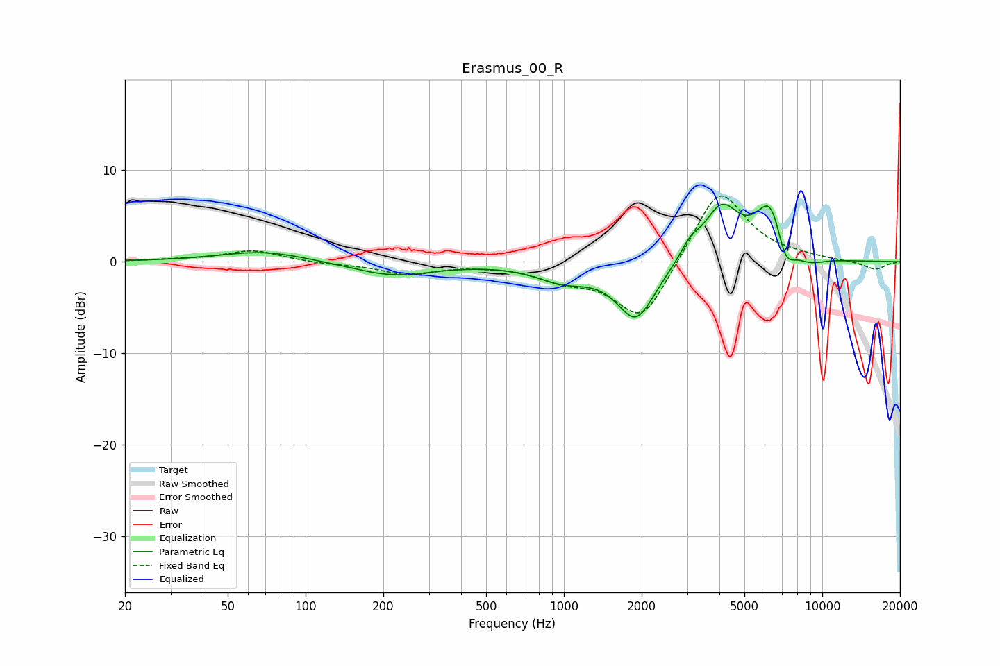

# Erasmus_00_R
See [usage instructions](https://github.com/jaakkopasanen/AutoEq#usage) for more options and info.

### Parametric EQs
Apply preamp of -6.4 dB when using parametric equalizer.

|   # | Type    |   Fc (Hz) |    Q |   Gain (dB) |
|-----|---------|-----------|------|-------------|
|   1 | Peaking |        69 | 0.83 |         1.2 |
|   2 | Peaking |       217 | 0.9  |        -1.5 |
|   3 | Peaking |       992 | 1.32 |        -1.8 |
|   4 | Peaking |      1895 | 2.53 |         0.3 |
|   5 | Peaking |      1903 | 1.91 |        -6.5 |
|   6 | Peaking |      3079 | 3.82 |         1.4 |
|   7 | Peaking |      4071 | 1.99 |         5.8 |
|   8 | Peaking |      6355 | 2.35 |         6.9 |
|   9 | Peaking |      7170 | 3.49 |        -4   |
|  10 | Peaking |      8911 | 2.17 |        -0.9 |

### Fixed Band EQs
When using fixed band (also called graphic) equalizer, apply preamp of **-7.3 dB** (if available) and set gains manually with these parameters.

|   # | Type    |   Fc (Hz) |    Q |   Gain (dB) |
|-----|---------|-----------|------|-------------|
|   1 | Peaking |        31 | 1.41 |         0.2 |
|   2 | Peaking |        62 | 1.41 |         1.2 |
|   3 | Peaking |       125 | 1.41 |        -0.2 |
|   4 | Peaking |       250 | 1.41 |        -1.3 |
|   5 | Peaking |       500 | 1.41 |        -0.2 |
|   6 | Peaking |      1000 | 1.41 |        -1.6 |
|   7 | Peaking |      2000 | 1.41 |        -6.7 |
|   8 | Peaking |      4000 | 1.41 |         8.4 |
|   9 | Peaking |      8000 | 1.41 |         0.3 |
|  10 | Peaking |     16000 | 1.41 |        -0.9 |

### Graphs

