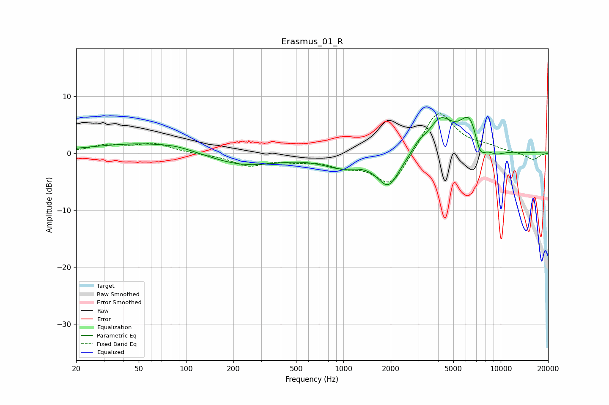

# Erasmus_01_R
See [usage instructions](https://github.com/jaakkopasanen/AutoEq#usage) for more options and info.

### Parametric EQs
Apply preamp of -6.4 dB when using parametric equalizer.

|   # | Type    |   Fc (Hz) |    Q |   Gain (dB) |
|-----|---------|-----------|------|-------------|
|   1 | Peaking |        67 | 0.37 |         2.1 |
|   2 | Peaking |        85 | 1.76 |         0.2 |
|   3 | Peaking |       216 | 0.59 |        -2.8 |
|   4 | Peaking |       969 | 1.16 |        -2   |
|   5 | Peaking |      1932 | 1.95 |        -5.7 |
|   6 | Peaking |      3017 | 3.5  |         1.1 |
|   7 | Peaking |      4119 | 1.78 |         5.4 |
|   8 | Peaking |      6437 | 2.05 |         6.8 |
|   9 | Peaking |      7346 | 3.4  |        -4.3 |
|  10 | Peaking |      9246 | 2.16 |        -1.1 |

### Fixed Band EQs
When using fixed band (also called graphic) equalizer, apply preamp of **-7.0 dB** (if available) and set gains manually with these parameters.

|   # | Type    |   Fc (Hz) |    Q |   Gain (dB) |
|-----|---------|-----------|------|-------------|
|   1 | Peaking |        31 | 1.41 |         1.3 |
|   2 | Peaking |        62 | 1.41 |         1.6 |
|   3 | Peaking |       125 | 1.41 |        -0.1 |
|   4 | Peaking |       250 | 1.41 |        -2.1 |
|   5 | Peaking |       500 | 1.41 |        -1   |
|   6 | Peaking |      1000 | 1.41 |        -1.8 |
|   7 | Peaking |      2000 | 1.41 |        -6.1 |
|   8 | Peaking |      4000 | 1.41 |         7.9 |
|   9 | Peaking |      8000 | 1.41 |         0.8 |
|  10 | Peaking |     16000 | 1.41 |        -1.2 |

### Graphs

