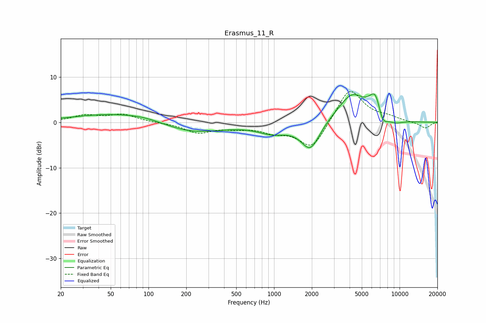

# Erasmus_11_R
See [usage instructions](https://github.com/jaakkopasanen/AutoEq#usage) for more options and info.

### Parametric EQs
Apply preamp of -6.4 dB when using parametric equalizer.

|   # | Type    |   Fc (Hz) |    Q |   Gain (dB) |
|-----|---------|-----------|------|-------------|
|   1 | Peaking |        53 | 0.43 |         1.9 |
|   2 | Peaking |        93 | 1.03 |         0.5 |
|   3 | Peaking |       224 | 0.58 |        -2.4 |
|   4 | Peaking |       970 | 1.16 |        -2   |
|   5 | Peaking |      1949 | 1.86 |        -6.2 |
|   6 | Peaking |      3342 | 1.08 |         1.2 |
|   7 | Peaking |      4214 | 1.45 |         5.1 |
|   8 | Peaking |      6475 | 2.53 |         6.6 |
|   9 | Peaking |      7244 | 3.06 |        -4.3 |
|  10 | Peaking |      9261 | 2.09 |        -0.9 |

### Fixed Band EQs
When using fixed band (also called graphic) equalizer, apply preamp of **-6.9 dB** (if available) and set gains manually with these parameters.

|   # | Type    |   Fc (Hz) |    Q |   Gain (dB) |
|-----|---------|-----------|------|-------------|
|   1 | Peaking |        31 | 1.41 |         1.4 |
|   2 | Peaking |        62 | 1.41 |         1.6 |
|   3 | Peaking |       125 | 1.41 |        -0.1 |
|   4 | Peaking |       250 | 1.41 |        -2.2 |
|   5 | Peaking |       500 | 1.41 |        -1   |
|   6 | Peaking |      1000 | 1.41 |        -1.7 |
|   7 | Peaking |      2000 | 1.41 |        -6   |
|   8 | Peaking |      4000 | 1.41 |         7.8 |
|   9 | Peaking |      8000 | 1.41 |         0.9 |
|  10 | Peaking |     16000 | 1.41 |        -1.3 |

### Graphs

