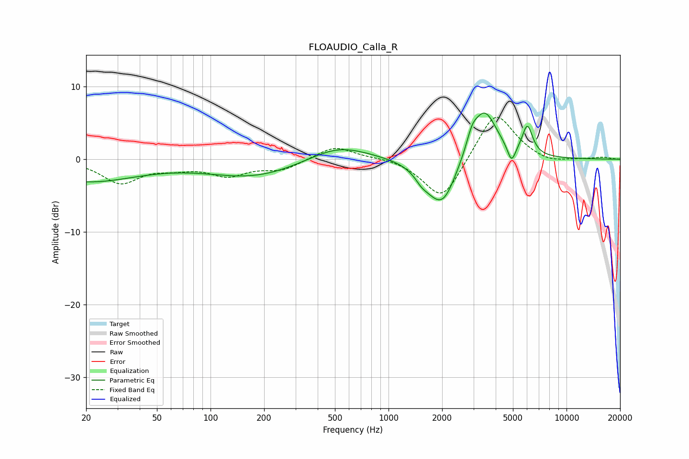

# FLOAUDIO_Calla_R
See [usage instructions](https://github.com/jaakkopasanen/AutoEq#usage) for more options and info.

### Parametric EQs
Apply preamp of -6.5 dB when using parametric equalizer.

|   # | Type    |   Fc (Hz) |    Q |   Gain (dB) |
|-----|---------|-----------|------|-------------|
|   1 | Peaking |        20 | 0.48 |        -3   |
|   2 | Peaking |       176 | 0.54 |        -2.4 |
|   3 | Peaking |       520 | 0.83 |         2.2 |
|   4 | Peaking |      1525 | 4.57 |        -0.6 |
|   5 | Peaking |      1711 | 1.84 |        -1.9 |
|   6 | Peaking |      2039 | 1.89 |        -5.4 |
|   7 | Peaking |      2944 | 4.72 |         1.9 |
|   8 | Peaking |      3456 | 1.96 |         7   |
|   9 | Peaking |      4910 | 6    |        -2.5 |
|  10 | Peaking |      6027 | 4.69 |         4   |

### Fixed Band EQs
When using fixed band (also called graphic) equalizer, apply preamp of **-5.9 dB** (if available) and set gains manually with these parameters.

|   # | Type    |   Fc (Hz) |    Q |   Gain (dB) |
|-----|---------|-----------|------|-------------|
|   1 | Peaking |        31 | 1.41 |        -3.2 |
|   2 | Peaking |        62 | 1.41 |        -0.9 |
|   3 | Peaking |       125 | 1.41 |        -2   |
|   4 | Peaking |       250 | 1.41 |        -1.4 |
|   5 | Peaking |       500 | 1.41 |         1.9 |
|   6 | Peaking |      1000 | 1.41 |         0.3 |
|   7 | Peaking |      2000 | 1.41 |        -5.9 |
|   8 | Peaking |      4000 | 1.41 |         6.9 |
|   9 | Peaking |      8000 | 1.41 |        -0.7 |
|  10 | Peaking |     16000 | 1.41 |         0.3 |

### Graphs

