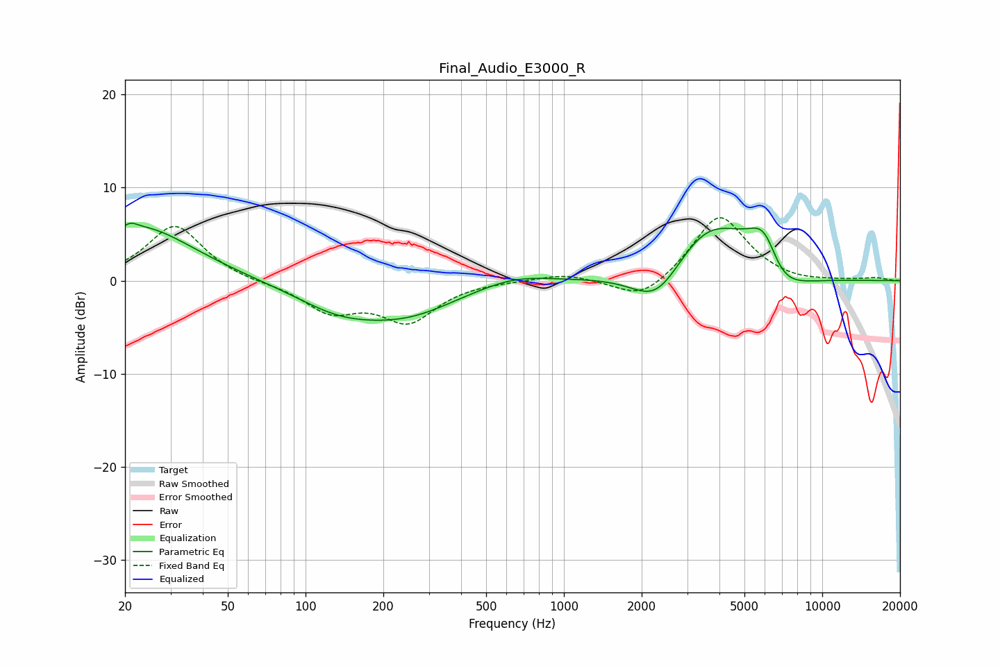

# Final_Audio_E3000_R
See [usage instructions](https://github.com/jaakkopasanen/AutoEq#usage) for more options and info.

### Parametric EQs
Apply preamp of -6.3 dB when using parametric equalizer.

|   # | Type    |   Fc (Hz) |    Q |   Gain (dB) |
|-----|---------|-----------|------|-------------|
|   1 | Peaking |        21 | 5.91 |         0.6 |
|   2 | Peaking |        23 | 0.68 |         5.8 |
|   3 | Peaking |       150 | 0.8  |        -4.4 |
|   4 | Peaking |       157 | 1.12 |         1.2 |
|   5 | Peaking |       267 | 0.79 |        -2.3 |
|   6 | Peaking |       644 | 1.06 |         1   |
|   7 | Peaking |      2297 | 1.4  |        -4.6 |
|   8 | Peaking |      3623 | 0.88 |         6.6 |
|   9 | Peaking |      6046 | 1.66 |        10.1 |
|  10 | Peaking |      6535 | 1.35 |        -8.6 |

### Fixed Band EQs
When using fixed band (also called graphic) equalizer, apply preamp of **-6.9 dB** (if available) and set gains manually with these parameters.

|   # | Type    |   Fc (Hz) |    Q |   Gain (dB) |
|-----|---------|-----------|------|-------------|
|   1 | Peaking |        31 | 1.41 |         6   |
|   2 | Peaking |        62 | 1.41 |        -0.2 |
|   3 | Peaking |       125 | 1.41 |        -3.1 |
|   4 | Peaking |       250 | 1.41 |        -4.1 |
|   5 | Peaking |       500 | 1.41 |         0   |
|   6 | Peaking |      1000 | 1.41 |         0.8 |
|   7 | Peaking |      2000 | 1.41 |        -2.4 |
|   8 | Peaking |      4000 | 1.41 |         7.2 |
|   9 | Peaking |      8000 | 1.41 |        -0.3 |
|  10 | Peaking |     16000 | 1.41 |         0.3 |

### Graphs

