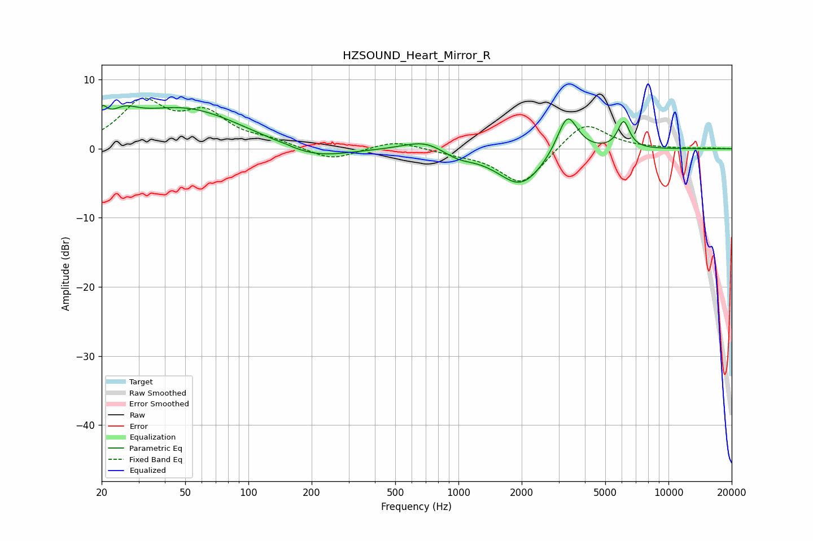

# HZSOUND_Heart_Mirror_R
See [usage instructions](https://github.com/jaakkopasanen/AutoEq#usage) for more options and info.

### Parametric EQs
Apply preamp of -6.4 dB when using parametric equalizer.

|   # | Type    |   Fc (Hz) |    Q |   Gain (dB) |
|-----|---------|-----------|------|-------------|
|   1 | Peaking |        20 | 5.9  |         2.4 |
|   2 | Peaking |        25 | 2.1  |         2.2 |
|   3 | Peaking |        49 | 0.52 |         5.8 |
|   4 | Peaking |       149 | 5.85 |         0.1 |
|   5 | Peaking |       205 | 0.88 |        -1.8 |
|   6 | Peaking |       698 | 1.38 |         1.6 |
|   7 | Peaking |       986 | 1.83 |        -1.2 |
|   8 | Peaking |      1982 | 1.27 |        -5.4 |
|   9 | Peaking |      3301 | 2.85 |         6.1 |
|  10 | Peaking |      6116 | 4.9  |         3.9 |

### Fixed Band EQs
When using fixed band (also called graphic) equalizer, apply preamp of **-7.4 dB** (if available) and set gains manually with these parameters.

|   # | Type    |   Fc (Hz) |    Q |   Gain (dB) |
|-----|---------|-----------|------|-------------|
|   1 | Peaking |        31 | 1.41 |         6.4 |
|   2 | Peaking |        62 | 1.41 |         4.5 |
|   3 | Peaking |       125 | 1.41 |         1   |
|   4 | Peaking |       250 | 1.41 |        -1.7 |
|   5 | Peaking |       500 | 1.41 |         1.2 |
|   6 | Peaking |      1000 | 1.41 |        -0.5 |
|   7 | Peaking |      2000 | 1.41 |        -5.3 |
|   8 | Peaking |      4000 | 1.41 |         4.1 |
|   9 | Peaking |      8000 | 1.41 |         0.1 |
|  10 | Peaking |     16000 | 1.41 |         0.1 |

### Graphs

