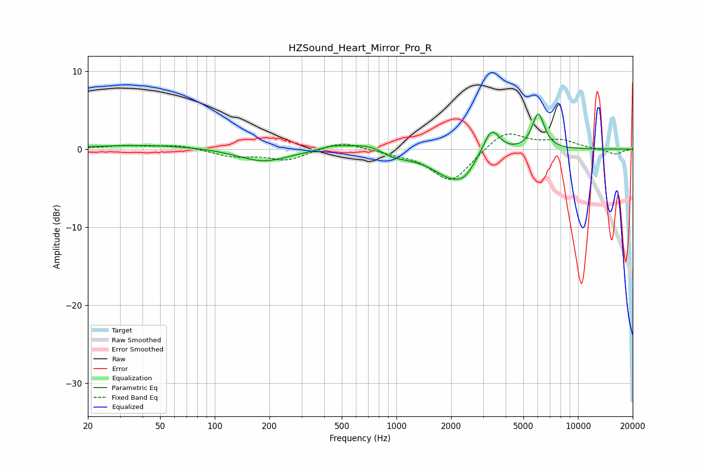

# HZSound_Heart_Mirror_Pro_R
See [usage instructions](https://github.com/jaakkopasanen/AutoEq#usage) for more options and info.

### Parametric EQs
Apply preamp of -4.6 dB when using parametric equalizer.

|   # | Type    |   Fc (Hz) |    Q |   Gain (dB) |
|-----|---------|-----------|------|-------------|
|   1 | Peaking |        43 | 0.45 |         0.5 |
|   2 | Peaking |       185 | 1.01 |        -1.6 |
|   3 | Peaking |       441 | 2.19 |         0.5 |
|   4 | Peaking |       708 | 1.27 |         1.1 |
|   5 | Peaking |       928 | 2.75 |        -0.4 |
|   6 | Peaking |      1035 | 1.28 |        -0.7 |
|   7 | Peaking |      2090 | 1.25 |        -3.8 |
|   8 | Peaking |      2378 | 3.84 |        -0.6 |
|   9 | Peaking |      3335 | 3.04 |         3.6 |
|  10 | Peaking |      6042 | 4.03 |         4.6 |

### Fixed Band EQs
When using fixed band (also called graphic) equalizer, apply preamp of **-2.0 dB** (if available) and set gains manually with these parameters.

|   # | Type    |   Fc (Hz) |    Q |   Gain (dB) |
|-----|---------|-----------|------|-------------|
|   1 | Peaking |        31 | 1.41 |         0.4 |
|   2 | Peaking |        62 | 1.41 |         0.5 |
|   3 | Peaking |       125 | 1.41 |        -0.9 |
|   4 | Peaking |       250 | 1.41 |        -1.4 |
|   5 | Peaking |       500 | 1.41 |         1.1 |
|   6 | Peaking |      1000 | 1.41 |        -0.4 |
|   7 | Peaking |      2000 | 1.41 |        -4.3 |
|   8 | Peaking |      4000 | 1.41 |         2.5 |
|   9 | Peaking |      8000 | 1.41 |         1   |
|  10 | Peaking |     16000 | 1.41 |        -0.7 |

### Graphs

