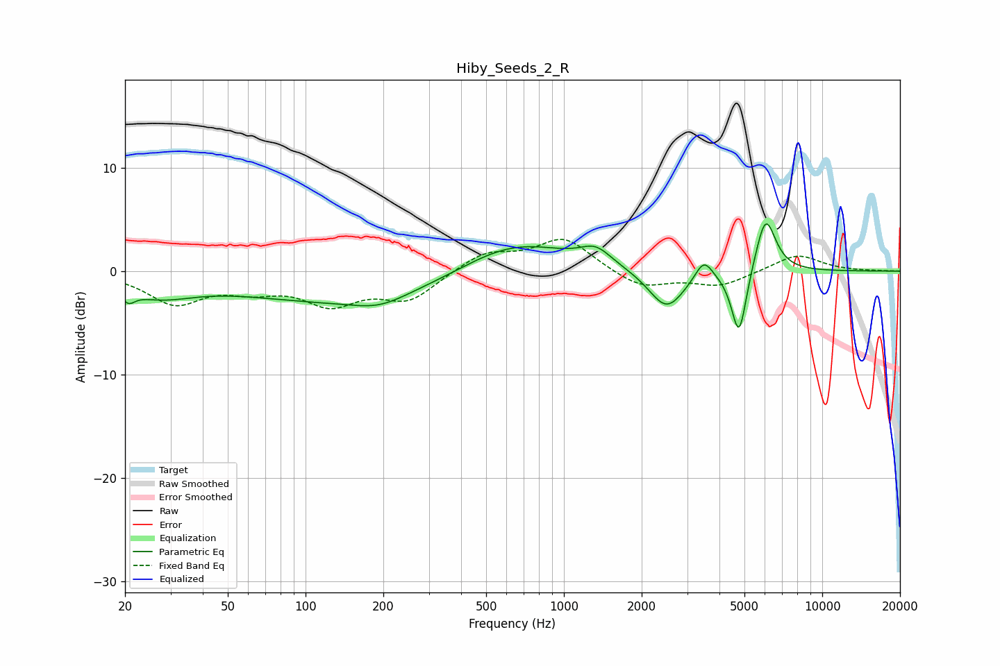

# Hiby_Seeds_2_R
See [usage instructions](https://github.com/jaakkopasanen/AutoEq#usage) for more options and info.

### Parametric EQs
Apply preamp of -4.7 dB when using parametric equalizer.

|   # | Type    |   Fc (Hz) |    Q |   Gain (dB) |
|-----|---------|-----------|------|-------------|
|   1 | Peaking |        21 | 5.71 |        -1.1 |
|   2 | Peaking |        27 | 1    |        -2   |
|   3 | Peaking |       152 | 0.32 |        -3   |
|   4 | Peaking |       193 | 1.38 |        -1   |
|   5 | Peaking |       631 | 0.65 |         3.4 |
|   6 | Peaking |      1330 | 2.38 |         1.5 |
|   7 | Peaking |      2500 | 2.01 |        -3.9 |
|   8 | Peaking |      3481 | 4.19 |         2   |
|   9 | Peaking |      4765 | 4.71 |        -6.7 |
|  10 | Peaking |      6031 | 3.48 |         5.6 |

### Fixed Band EQs
When using fixed band (also called graphic) equalizer, apply preamp of **-3.2 dB** (if available) and set gains manually with these parameters.

|   # | Type    |   Fc (Hz) |    Q |   Gain (dB) |
|-----|---------|-----------|------|-------------|
|   1 | Peaking |        31 | 1.41 |        -3   |
|   2 | Peaking |        62 | 1.41 |        -1.4 |
|   3 | Peaking |       125 | 1.41 |        -2.9 |
|   4 | Peaking |       250 | 1.41 |        -2.7 |
|   5 | Peaking |       500 | 1.41 |         1.8 |
|   6 | Peaking |      1000 | 1.41 |         3.2 |
|   7 | Peaking |      2000 | 1.41 |        -1.7 |
|   8 | Peaking |      4000 | 1.41 |        -1.4 |
|   9 | Peaking |      8000 | 1.41 |         1.7 |
|  10 | Peaking |     16000 | 1.41 |         0   |

### Graphs

