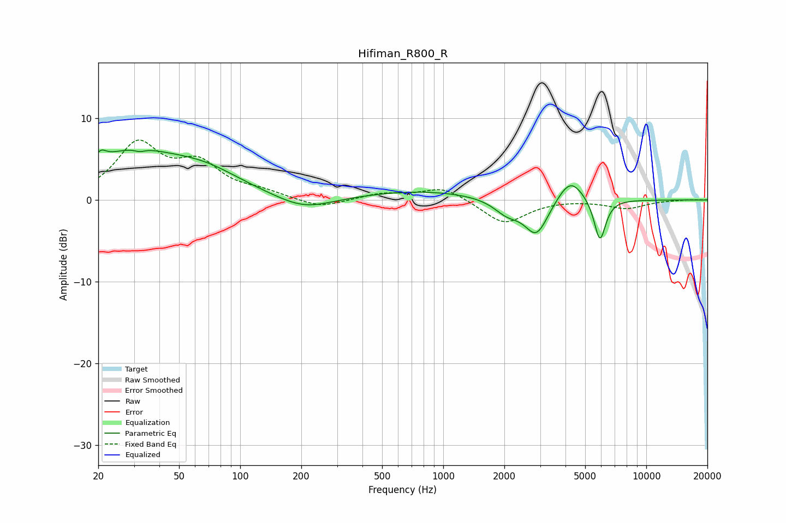

# Hifiman_R800_R
See [usage instructions](https://github.com/jaakkopasanen/AutoEq#usage) for more options and info.

### Parametric EQs
Apply preamp of -6.2 dB when using parametric equalizer.

|   # | Type    |   Fc (Hz) |    Q |   Gain (dB) |
|-----|---------|-----------|------|-------------|
|   1 | Peaking |        21 | 5.27 |         1.2 |
|   2 | Peaking |        28 | 0.64 |         5.2 |
|   3 | Peaking |        32 | 5.68 |        -0.3 |
|   4 | Peaking |        67 | 0.73 |         2.7 |
|   5 | Peaking |       207 | 1.04 |        -1.6 |
|   6 | Peaking |       783 | 0.48 |         1.1 |
|   7 | Peaking |      2063 | 2.15 |        -1.7 |
|   8 | Peaking |      2880 | 2.41 |        -4.4 |
|   9 | Peaking |      4227 | 2.18 |         3   |
|  10 | Peaking |      5910 | 4.79 |        -5.3 |

### Fixed Band EQs
When using fixed band (also called graphic) equalizer, apply preamp of **-7.4 dB** (if available) and set gains manually with these parameters.

|   # | Type    |   Fc (Hz) |    Q |   Gain (dB) |
|-----|---------|-----------|------|-------------|
|   1 | Peaking |        31 | 1.41 |         6.6 |
|   2 | Peaking |        62 | 1.41 |         3.9 |
|   3 | Peaking |       125 | 1.41 |         0.8 |
|   4 | Peaking |       250 | 1.41 |        -1.1 |
|   5 | Peaking |       500 | 1.41 |         0.7 |
|   6 | Peaking |      1000 | 1.41 |         1.6 |
|   7 | Peaking |      2000 | 1.41 |        -2.9 |
|   8 | Peaking |      4000 | 1.41 |         0.1 |
|   9 | Peaking |      8000 | 1.41 |        -1   |
|  10 | Peaking |     16000 | 1.41 |         0.1 |

### Graphs

