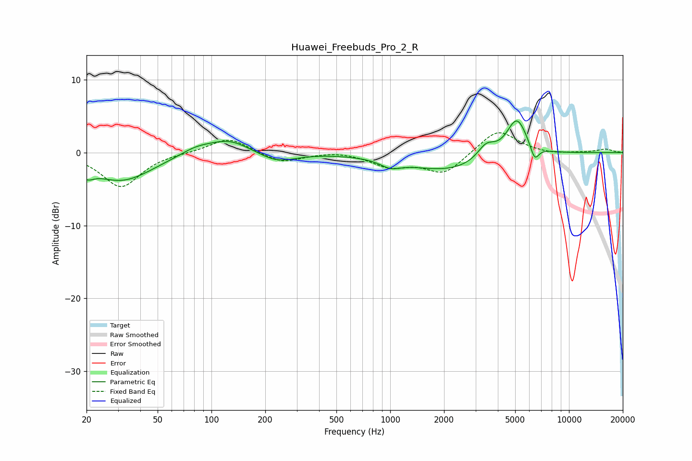

# Huawei_Freebuds_Pro_2_R
See [usage instructions](https://github.com/jaakkopasanen/AutoEq#usage) for more options and info.

### Parametric EQs
Apply preamp of -4.4 dB when using parametric equalizer.

|   # | Type    |   Fc (Hz) |    Q |   Gain (dB) |
|-----|---------|-----------|------|-------------|
|   1 | Peaking |        20 | 3.66 |        -1.4 |
|   2 | Peaking |        32 | 0.82 |        -3.8 |
|   3 | Peaking |        82 | 1.57 |         0.9 |
|   4 | Peaking |       125 | 1.22 |         1.9 |
|   5 | Peaking |       233 | 1.38 |        -1.4 |
|   6 | Peaking |      1004 | 2.52 |        -1   |
|   7 | Peaking |      2120 | 0.6  |        -2.5 |
|   8 | Peaking |      3444 | 2.82 |         2   |
|   9 | Peaking |      5108 | 2.39 |         5.2 |
|  10 | Peaking |      6425 | 5.59 |        -2.1 |

### Fixed Band EQs
When using fixed band (also called graphic) equalizer, apply preamp of **-2.8 dB** (if available) and set gains manually with these parameters.

|   # | Type    |   Fc (Hz) |    Q |   Gain (dB) |
|-----|---------|-----------|------|-------------|
|   1 | Peaking |        31 | 1.41 |        -4.7 |
|   2 | Peaking |        62 | 1.41 |         0   |
|   3 | Peaking |       125 | 1.41 |         2.1 |
|   4 | Peaking |       250 | 1.41 |        -1.4 |
|   5 | Peaking |       500 | 1.41 |         0.3 |
|   6 | Peaking |      1000 | 1.41 |        -1.8 |
|   7 | Peaking |      2000 | 1.41 |        -2.9 |
|   8 | Peaking |      4000 | 1.41 |         3.3 |
|   9 | Peaking |      8000 | 1.41 |        -0.3 |
|  10 | Peaking |     16000 | 1.41 |         0.5 |

### Graphs

