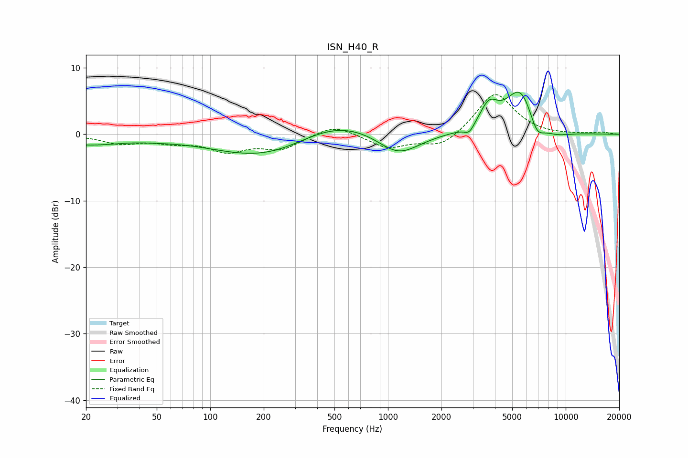

# ISN_H40_R
See [usage instructions](https://github.com/jaakkopasanen/AutoEq#usage) for more options and info.

### Parametric EQs
Apply preamp of -6.4 dB when using parametric equalizer.

|   # | Type    |   Fc (Hz) |    Q |   Gain (dB) |
|-----|---------|-----------|------|-------------|
|   1 | Peaking |        20 | 0.73 |        -1.5 |
|   2 | Peaking |        52 | 1.32 |        -0.2 |
|   3 | Peaking |       229 | 0.46 |        -4.5 |
|   4 | Peaking |       474 | 0.54 |         3.9 |
|   5 | Peaking |      1144 | 1.16 |        -3.6 |
|   6 | Peaking |      2871 | 4.92 |        -1.3 |
|   7 | Peaking |      3694 | 2.73 |         3.5 |
|   8 | Peaking |      5573 | 1.64 |         7   |
|   9 | Peaking |      6867 | 3.17 |        -3   |
|  10 | Peaking |      8567 | 1.45 |        -1.1 |

### Fixed Band EQs
When using fixed band (also called graphic) equalizer, apply preamp of **-6.1 dB** (if available) and set gains manually with these parameters.

|   # | Type    |   Fc (Hz) |    Q |   Gain (dB) |
|-----|---------|-----------|------|-------------|
|   1 | Peaking |        31 | 1.41 |        -1.3 |
|   2 | Peaking |        62 | 1.41 |        -1   |
|   3 | Peaking |       125 | 1.41 |        -2.3 |
|   4 | Peaking |       250 | 1.41 |        -2.1 |
|   5 | Peaking |       500 | 1.41 |         1.6 |
|   6 | Peaking |      1000 | 1.41 |        -2   |
|   7 | Peaking |      2000 | 1.41 |        -2   |
|   8 | Peaking |      4000 | 1.41 |         6.4 |
|   9 | Peaking |      8000 | 1.41 |        -0.1 |
|  10 | Peaking |     16000 | 1.41 |         0.3 |

### Graphs

