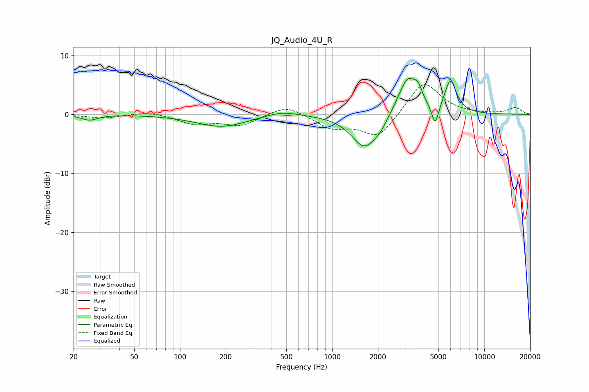

# JQ_Audio_4U_R
See [usage instructions](https://github.com/jaakkopasanen/AutoEq#usage) for more options and info.

### Parametric EQs
Apply preamp of -6.2 dB when using parametric equalizer.

|   # | Type    |   Fc (Hz) |    Q |   Gain (dB) |
|-----|---------|-----------|------|-------------|
|   1 | Peaking |        25 | 2.69 |        -0.9 |
|   2 | Peaking |       188 | 0.84 |        -2.1 |
|   3 | Peaking |       466 | 1.33 |         0.9 |
|   4 | Peaking |      1616 | 1.62 |        -5.2 |
|   5 | Peaking |      1659 | 3.01 |        -0.4 |
|   6 | Peaking |      2052 | 2.92 |        -1.4 |
|   7 | Peaking |      3144 | 2.17 |         6.5 |
|   8 | Peaking |      3678 | 5.57 |         1.8 |
|   9 | Peaking |      4758 | 5.93 |        -3.7 |
|  10 | Peaking |      5993 | 3.55 |         5.5 |

### Fixed Band EQs
When using fixed band (also called graphic) equalizer, apply preamp of **-5.1 dB** (if available) and set gains manually with these parameters.

|   # | Type    |   Fc (Hz) |    Q |   Gain (dB) |
|-----|---------|-----------|------|-------------|
|   1 | Peaking |        31 | 1.41 |        -0.6 |
|   2 | Peaking |        62 | 1.41 |         0.6 |
|   3 | Peaking |       125 | 1.41 |        -1.5 |
|   4 | Peaking |       250 | 1.41 |        -1.8 |
|   5 | Peaking |       500 | 1.41 |         1.7 |
|   6 | Peaking |      1000 | 1.41 |        -2.2 |
|   7 | Peaking |      2000 | 1.41 |        -4   |
|   8 | Peaking |      4000 | 1.41 |         5.8 |
|   9 | Peaking |      8000 | 1.41 |         0   |
|  10 | Peaking |     16000 | 1.41 |         1.1 |

### Graphs

