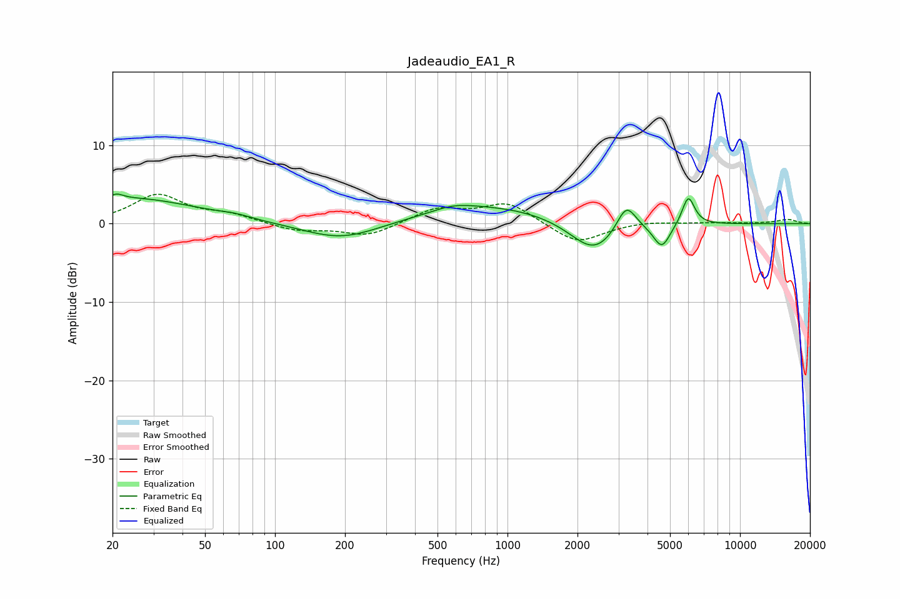

# Jadeaudio_EA1_R
See [usage instructions](https://github.com/jaakkopasanen/AutoEq#usage) for more options and info.

### Parametric EQs
Apply preamp of -3.9 dB when using parametric equalizer.

|   # | Type    |   Fc (Hz) |    Q |   Gain (dB) |
|-----|---------|-----------|------|-------------|
|   1 | Peaking |        21 | 4.85 |         0.7 |
|   2 | Peaking |        24 | 0.51 |         3.2 |
|   3 | Peaking |        67 | 1.97 |         0.4 |
|   4 | Peaking |       193 | 0.87 |        -2.2 |
|   5 | Peaking |       587 | 1.61 |         0.7 |
|   6 | Peaking |       871 | 0.46 |         2.3 |
|   7 | Peaking |      2360 | 1.36 |        -4.4 |
|   8 | Peaking |      3242 | 3.3  |         3.7 |
|   9 | Peaking |      4611 | 3.84 |        -3.1 |
|  10 | Peaking |      5992 | 5.07 |         3.8 |

### Fixed Band EQs
When using fixed band (also called graphic) equalizer, apply preamp of **-3.9 dB** (if available) and set gains manually with these parameters.

|   # | Type    |   Fc (Hz) |    Q |   Gain (dB) |
|-----|---------|-----------|------|-------------|
|   1 | Peaking |        31 | 1.41 |         3.6 |
|   2 | Peaking |        62 | 1.41 |         1   |
|   3 | Peaking |       125 | 1.41 |        -0.9 |
|   4 | Peaking |       250 | 1.41 |        -1.6 |
|   5 | Peaking |       500 | 1.41 |         1.9 |
|   6 | Peaking |      1000 | 1.41 |         2.6 |
|   7 | Peaking |      2000 | 1.41 |        -2.6 |
|   8 | Peaking |      4000 | 1.41 |         0.3 |
|   9 | Peaking |      8000 | 1.41 |         0.1 |
|  10 | Peaking |     16000 | 1.41 |         0.5 |

### Graphs

