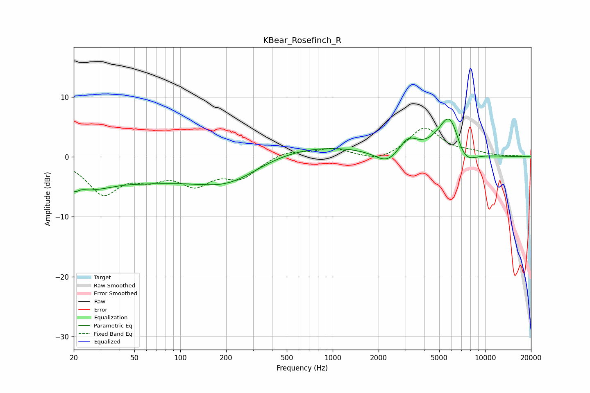

# KBear_Rosefinch_R
See [usage instructions](https://github.com/jaakkopasanen/AutoEq#usage) for more options and info.

### Parametric EQs
Apply preamp of -6.4 dB when using parametric equalizer.

|   # | Type    |   Fc (Hz) |    Q |   Gain (dB) |
|-----|---------|-----------|------|-------------|
|   1 | Peaking |        20 | 4.02 |        -2.4 |
|   2 | Peaking |        25 | 2.88 |        -0.7 |
|   3 | Peaking |        28 | 1.11 |        -2.3 |
|   4 | Peaking |        63 | 0.4  |        -3.6 |
|   5 | Peaking |       210 | 0.62 |        -5   |
|   6 | Peaking |       435 | 0.25 |         2.6 |
|   7 | Peaking |      2285 | 1.78 |        -2.3 |
|   8 | Peaking |      3123 | 2.3  |         2.5 |
|   9 | Peaking |      5886 | 1.79 |         8.2 |
|  10 | Peaking |      7206 | 1.8  |        -4   |

### Fixed Band EQs
When using fixed band (also called graphic) equalizer, apply preamp of **-4.9 dB** (if available) and set gains manually with these parameters.

|   # | Type    |   Fc (Hz) |    Q |   Gain (dB) |
|-----|---------|-----------|------|-------------|
|   1 | Peaking |        31 | 1.41 |        -5.8 |
|   2 | Peaking |        62 | 1.41 |        -2.6 |
|   3 | Peaking |       125 | 1.41 |        -4   |
|   4 | Peaking |       250 | 1.41 |        -3.1 |
|   5 | Peaking |       500 | 1.41 |         1.1 |
|   6 | Peaking |      1000 | 1.41 |         1.4 |
|   7 | Peaking |      2000 | 1.41 |        -1   |
|   8 | Peaking |      4000 | 1.41 |         4.8 |
|   9 | Peaking |      8000 | 1.41 |         0.6 |
|  10 | Peaking |     16000 | 1.41 |         0.1 |

### Graphs

