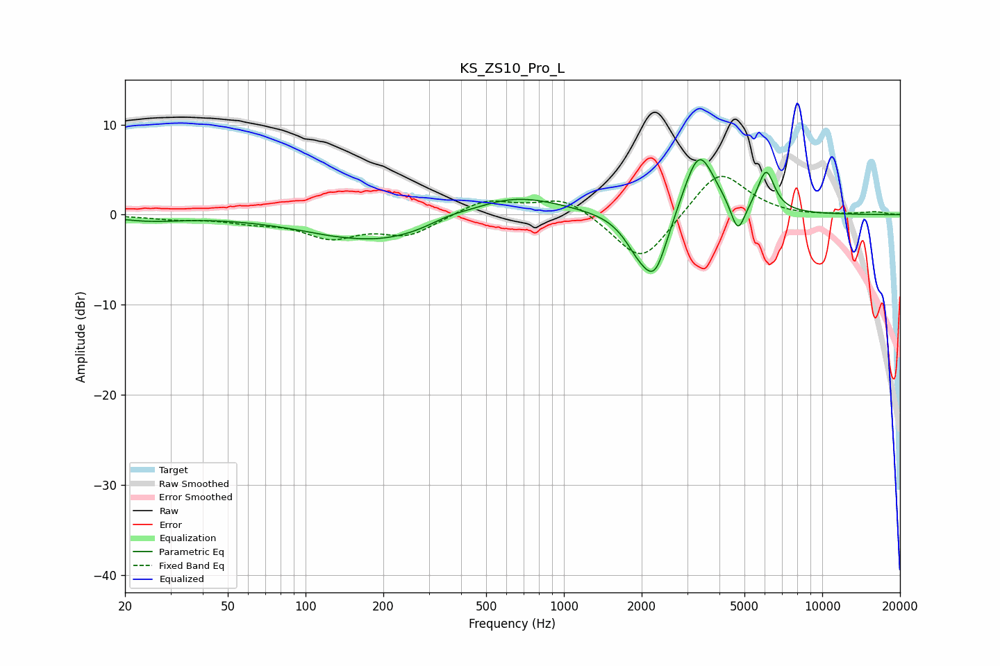

# KS_ZS10_Pro_L
See [usage instructions](https://github.com/jaakkopasanen/AutoEq#usage) for more options and info.

### Parametric EQs
Apply preamp of -6.2 dB when using parametric equalizer.

|   # | Type    |   Fc (Hz) |    Q |   Gain (dB) |
|-----|---------|-----------|------|-------------|
|   1 | Peaking |        25 | 1.18 |        -0.6 |
|   2 | Peaking |       123 | 3.57 |        -0   |
|   3 | Peaking |       197 | 0.53 |        -3.1 |
|   4 | Peaking |       355 | 1.82 |         0.6 |
|   5 | Peaking |       629 | 0.76 |         2.6 |
|   6 | Peaking |      1927 | 2.54 |        -2.4 |
|   7 | Peaking |      2252 | 2.59 |        -6.7 |
|   8 | Peaking |      3330 | 2.25 |         7.6 |
|   9 | Peaking |      4716 | 5.05 |        -3.6 |
|  10 | Peaking |      6064 | 4.25 |         4.5 |

### Fixed Band EQs
When using fixed band (also called graphic) equalizer, apply preamp of **-4.3 dB** (if available) and set gains manually with these parameters.

|   # | Type    |   Fc (Hz) |    Q |   Gain (dB) |
|-----|---------|-----------|------|-------------|
|   1 | Peaking |        31 | 1.41 |        -0.4 |
|   2 | Peaking |        62 | 1.41 |        -0.7 |
|   3 | Peaking |       125 | 1.41 |        -2.3 |
|   4 | Peaking |       250 | 1.41 |        -2.2 |
|   5 | Peaking |       500 | 1.41 |         1.7 |
|   6 | Peaking |      1000 | 1.41 |         2   |
|   7 | Peaking |      2000 | 1.41 |        -5.6 |
|   8 | Peaking |      4000 | 1.41 |         5.2 |
|   9 | Peaking |      8000 | 1.41 |        -0.2 |
|  10 | Peaking |     16000 | 1.41 |         0.3 |

### Graphs

