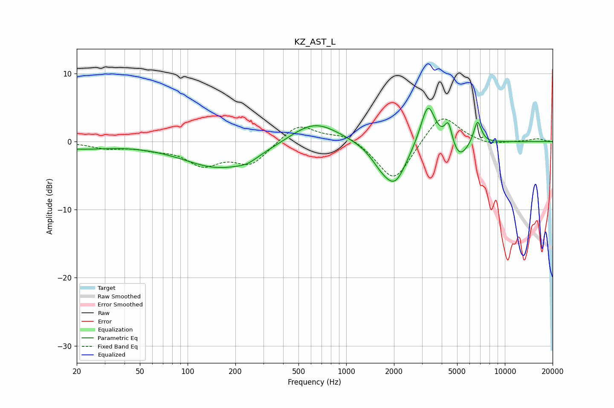

# KZ_AST_L
See [usage instructions](https://github.com/jaakkopasanen/AutoEq#usage) for more options and info.

### Parametric EQs
Apply preamp of -5.0 dB when using parametric equalizer.

|   # | Type    |   Fc (Hz) |    Q |   Gain (dB) |
|-----|---------|-----------|------|-------------|
|   1 | Peaking |        20 | 0.73 |        -0.9 |
|   2 | Peaking |       161 | 0.6  |        -3.9 |
|   3 | Peaking |       238 | 2.3  |        -0.6 |
|   4 | Peaking |       628 | 0.93 |         3.3 |
|   5 | Peaking |      1662 | 1.96 |        -2   |
|   6 | Peaking |      2041 | 1.9  |        -5.5 |
|   7 | Peaking |      3272 | 3.03 |         6.3 |
|   8 | Peaking |      4407 | 5.94 |         3.2 |
|   9 | Peaking |      5156 | 2.59 |        -2.7 |
|  10 | Peaking |      6728 | 5.56 |         3.4 |

### Fixed Band EQs
When using fixed band (also called graphic) equalizer, apply preamp of **-3.4 dB** (if available) and set gains manually with these parameters.

|   # | Type    |   Fc (Hz) |    Q |   Gain (dB) |
|-----|---------|-----------|------|-------------|
|   1 | Peaking |        31 | 1.41 |        -0.9 |
|   2 | Peaking |        62 | 1.41 |        -0.8 |
|   3 | Peaking |       125 | 1.41 |        -3.1 |
|   4 | Peaking |       250 | 1.41 |        -3.2 |
|   5 | Peaking |       500 | 1.41 |         2.7 |
|   6 | Peaking |      1000 | 1.41 |         1.2 |
|   7 | Peaking |      2000 | 1.41 |        -6.1 |
|   8 | Peaking |      4000 | 1.41 |         4.4 |
|   9 | Peaking |      8000 | 1.41 |        -0.6 |
|  10 | Peaking |     16000 | 1.41 |         0.4 |

### Graphs

