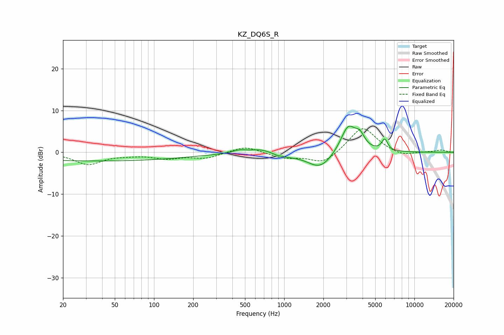

# KZ_DQ6S_R
See [usage instructions](https://github.com/jaakkopasanen/AutoEq#usage) for more options and info.

### Parametric EQs
Apply preamp of -6.4 dB when using parametric equalizer.

|   # | Type    |   Fc (Hz) |    Q |   Gain (dB) |
|-----|---------|-----------|------|-------------|
|   1 | Peaking |        36 | 0.18 |        -2.1 |
|   2 | Peaking |       451 | 2.65 |         0.7 |
|   3 | Peaking |       659 | 1.68 |         1   |
|   4 | Peaking |       893 | 5.99 |        -0.7 |
|   5 | Peaking |       899 | 6    |         0.6 |
|   6 | Peaking |      1012 | 1.68 |        -0.7 |
|   7 | Peaking |      1894 | 1.44 |        -4   |
|   8 | Peaking |      3099 | 2.39 |         6.6 |
|   9 | Peaking |      3812 | 3.82 |         2.7 |
|  10 | Peaking |      5915 | 6    |         2.7 |

### Fixed Band EQs
When using fixed band (also called graphic) equalizer, apply preamp of **-5.7 dB** (if available) and set gains manually with these parameters.

|   # | Type    |   Fc (Hz) |    Q |   Gain (dB) |
|-----|---------|-----------|------|-------------|
|   1 | Peaking |        31 | 1.41 |        -2.8 |
|   2 | Peaking |        62 | 1.41 |        -0.4 |
|   3 | Peaking |       125 | 1.41 |        -1.3 |
|   4 | Peaking |       250 | 1.41 |        -1.4 |
|   5 | Peaking |       500 | 1.41 |         1.6 |
|   6 | Peaking |      1000 | 1.41 |        -1.3 |
|   7 | Peaking |      2000 | 1.41 |        -2.8 |
|   8 | Peaking |      4000 | 1.41 |         6.3 |
|   9 | Peaking |      8000 | 1.41 |        -1.1 |
|  10 | Peaking |     16000 | 1.41 |         0.5 |

### Graphs

