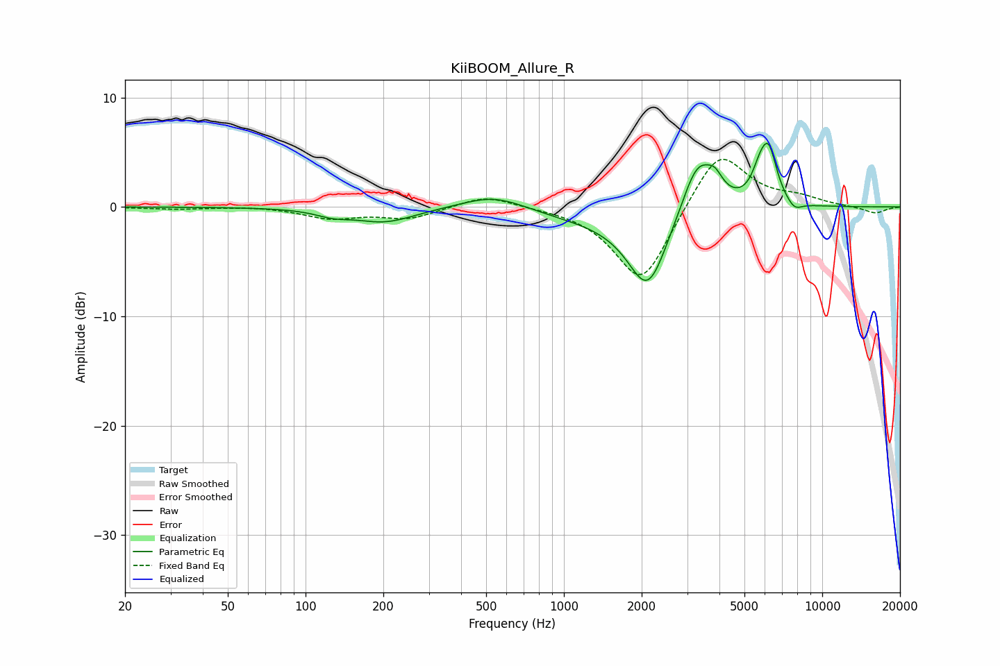

# KiiBOOM_Allure_R
See [usage instructions](https://github.com/jaakkopasanen/AutoEq#usage) for more options and info.

### Parametric EQs
Apply preamp of -5.9 dB when using parametric equalizer.

|   # | Type    |   Fc (Hz) |    Q |   Gain (dB) |
|-----|---------|-----------|------|-------------|
|   1 | Peaking |       127 | 2.19 |        -0.5 |
|   2 | Peaking |       202 | 1.19 |        -1.4 |
|   3 | Peaking |       537 | 1.14 |         1.4 |
|   4 | Peaking |      1552 | 0.53 |        -1.2 |
|   5 | Peaking |      2114 | 1.86 |        -6.8 |
|   6 | Peaking |      3301 | 2.15 |         5.4 |
|   7 | Peaking |      3849 | 4.85 |         1.2 |
|   8 | Peaking |      5728 | 4.42 |         1.9 |
|   9 | Peaking |      6208 | 4.18 |         4.6 |
|  10 | Peaking |      7796 | 4.43 |        -0.8 |

### Fixed Band EQs
When using fixed band (also called graphic) equalizer, apply preamp of **-4.4 dB** (if available) and set gains manually with these parameters.

|   # | Type    |   Fc (Hz) |    Q |   Gain (dB) |
|-----|---------|-----------|------|-------------|
|   1 | Peaking |        31 | 1.41 |        -0.2 |
|   2 | Peaking |        62 | 1.41 |         0.1 |
|   3 | Peaking |       125 | 1.41 |        -1   |
|   4 | Peaking |       250 | 1.41 |        -1   |
|   5 | Peaking |       500 | 1.41 |         1.2 |
|   6 | Peaking |      1000 | 1.41 |        -0   |
|   7 | Peaking |      2000 | 1.41 |        -7.2 |
|   8 | Peaking |      4000 | 1.41 |         5.5 |
|   9 | Peaking |      8000 | 1.41 |         0.7 |
|  10 | Peaking |     16000 | 1.41 |        -0.6 |

### Graphs

