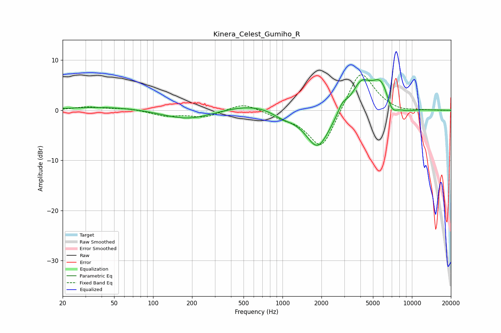

# Kinera_Celest_Gumiho_R
See [usage instructions](https://github.com/jaakkopasanen/AutoEq#usage) for more options and info.

### Parametric EQs
Apply preamp of -6.2 dB when using parametric equalizer.

|   # | Type    |   Fc (Hz) |    Q |   Gain (dB) |
|-----|---------|-----------|------|-------------|
|   1 | Peaking |        47 | 0.45 |         0.7 |
|   2 | Peaking |       185 | 0.72 |        -2   |
|   3 | Peaking |       608 | 0.6  |         1.5 |
|   4 | Peaking |      1008 | 1.58 |        -1.3 |
|   5 | Peaking |      1867 | 1.49 |        -7.8 |
|   6 | Peaking |      2906 | 3.85 |         1.8 |
|   7 | Peaking |      4034 | 2.01 |         4.9 |
|   8 | Peaking |      5824 | 1.76 |         6.3 |
|   9 | Peaking |      6960 | 2.83 |        -3.6 |
|  10 | Peaking |      9073 | 1.86 |        -0.8 |

### Fixed Band EQs
When using fixed band (also called graphic) equalizer, apply preamp of **-7.2 dB** (if available) and set gains manually with these parameters.

|   # | Type    |   Fc (Hz) |    Q |   Gain (dB) |
|-----|---------|-----------|------|-------------|
|   1 | Peaking |        31 | 1.41 |         0.7 |
|   2 | Peaking |        62 | 1.41 |         0.4 |
|   3 | Peaking |       125 | 1.41 |        -1.1 |
|   4 | Peaking |       250 | 1.41 |        -1.3 |
|   5 | Peaking |       500 | 1.41 |         1.6 |
|   6 | Peaking |      1000 | 1.41 |        -0.9 |
|   7 | Peaking |      2000 | 1.41 |        -8.2 |
|   8 | Peaking |      4000 | 1.41 |         8.7 |
|   9 | Peaking |      8000 | 1.41 |        -0.5 |
|  10 | Peaking |     16000 | 1.41 |        -0   |

### Graphs

