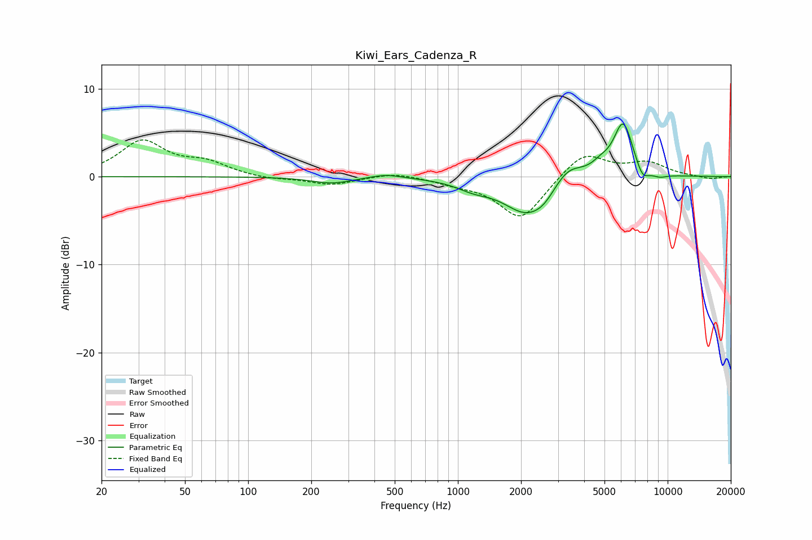

# Kiwi_Ears_Cadenza_R
See [usage instructions](https://github.com/jaakkopasanen/AutoEq#usage) for more options and info.

### Parametric EQs
Apply preamp of -6.1 dB when using parametric equalizer.

|   # | Type    |   Fc (Hz) |    Q |   Gain (dB) |
|-----|---------|-----------|------|-------------|
|   1 | Peaking |       251 | 1.47 |        -0.7 |
|   2 | Peaking |       454 | 1.84 |         0.5 |
|   3 | Peaking |      1187 | 1.72 |        -0.9 |
|   4 | Peaking |      2123 | 1.26 |        -4.1 |
|   5 | Peaking |      2581 | 2.54 |        -0.9 |
|   6 | Peaking |      3332 | 1.93 |         2   |
|   7 | Peaking |      4777 | 3.26 |         0.8 |
|   8 | Peaking |      6140 | 2.84 |         6.2 |
|   9 | Peaking |      7573 | 4.33 |        -1.6 |
|  10 | Peaking |      9133 | 3.3  |        -0.4 |

### Fixed Band EQs
When using fixed band (also called graphic) equalizer, apply preamp of **-4.3 dB** (if available) and set gains manually with these parameters.

|   # | Type    |   Fc (Hz) |    Q |   Gain (dB) |
|-----|---------|-----------|------|-------------|
|   1 | Peaking |        31 | 1.41 |         3.9 |
|   2 | Peaking |        62 | 1.41 |         1.4 |
|   3 | Peaking |       125 | 1.41 |        -0.3 |
|   4 | Peaking |       250 | 1.41 |        -0.9 |
|   5 | Peaking |       500 | 1.41 |         0.5 |
|   6 | Peaking |      1000 | 1.41 |        -0.6 |
|   7 | Peaking |      2000 | 1.41 |        -4.9 |
|   8 | Peaking |      4000 | 1.41 |         2.9 |
|   9 | Peaking |      8000 | 1.41 |         1.5 |
|  10 | Peaking |     16000 | 1.41 |        -0.3 |

### Graphs

