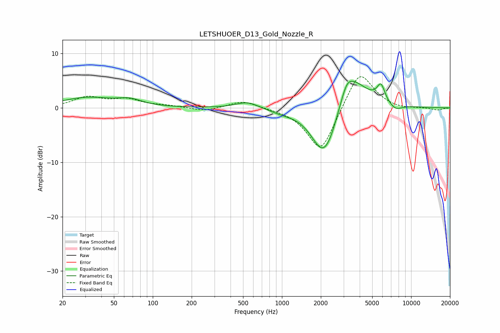

# LETSHUOER_D13_Gold_Nozzle_R
See [usage instructions](https://github.com/jaakkopasanen/AutoEq#usage) for more options and info.

### Parametric EQs
Apply preamp of -5.0 dB when using parametric equalizer.

|   # | Type    |   Fc (Hz) |    Q |   Gain (dB) |
|-----|---------|-----------|------|-------------|
|   1 | Peaking |        31 | 0.73 |         1.8 |
|   2 | Peaking |        66 | 1.49 |         1.1 |
|   3 | Peaking |       542 | 1.6  |         1.2 |
|   4 | Peaking |      1000 | 1.32 |        -0.6 |
|   5 | Peaking |      2049 | 1.45 |        -7.2 |
|   6 | Peaking |      2314 | 1.75 |        -3.4 |
|   7 | Peaking |      3182 | 3.51 |         1.9 |
|   8 | Peaking |      3426 | 1.13 |         6.6 |
|   9 | Peaking |      5841 | 4.57 |         3   |
|  10 | Peaking |      7546 | 2.62 |        -1.2 |

### Fixed Band EQs
When using fixed band (also called graphic) equalizer, apply preamp of **-5.8 dB** (if available) and set gains manually with these parameters.

|   # | Type    |   Fc (Hz) |    Q |   Gain (dB) |
|-----|---------|-----------|------|-------------|
|   1 | Peaking |        31 | 1.41 |         1.9 |
|   2 | Peaking |        62 | 1.41 |         1.4 |
|   3 | Peaking |       125 | 1.41 |         0.3 |
|   4 | Peaking |       250 | 1.41 |        -0.6 |
|   5 | Peaking |       500 | 1.41 |         1.4 |
|   6 | Peaking |      1000 | 1.41 |        -0   |
|   7 | Peaking |      2000 | 1.41 |        -8.4 |
|   8 | Peaking |      4000 | 1.41 |         7.3 |
|   9 | Peaking |      8000 | 1.41 |        -0.4 |
|  10 | Peaking |     16000 | 1.41 |        -0.4 |

### Graphs

