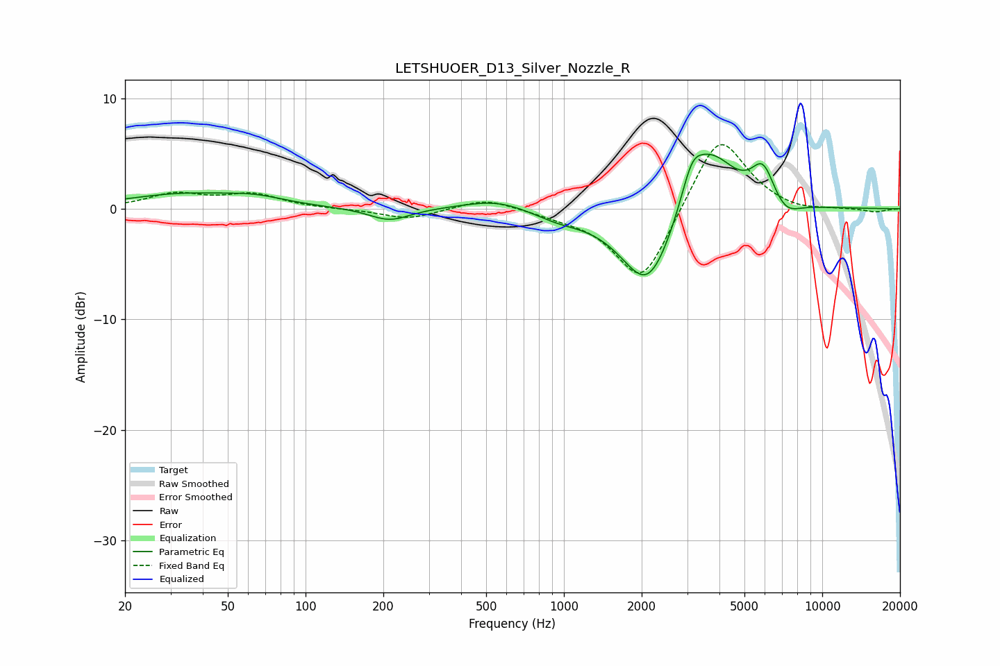

# LETSHUOER_D13_Silver_Nozzle_R
See [usage instructions](https://github.com/jaakkopasanen/AutoEq#usage) for more options and info.

### Parametric EQs
Apply preamp of -5.0 dB when using parametric equalizer.

|   # | Type    |   Fc (Hz) |    Q |   Gain (dB) |
|-----|---------|-----------|------|-------------|
|   1 | Peaking |        33 | 0.65 |         1.2 |
|   2 | Peaking |        64 | 1.21 |         0.7 |
|   3 | Peaking |       211 | 1.78 |        -1.2 |
|   4 | Peaking |       553 | 1.09 |         1   |
|   5 | Peaking |       945 | 1.38 |        -0.8 |
|   6 | Peaking |      2119 | 1.34 |        -7.7 |
|   7 | Peaking |      3128 | 3.43 |         2.8 |
|   8 | Peaking |      3679 | 1.41 |         5.7 |
|   9 | Peaking |      5900 | 3.05 |         3.3 |
|  10 | Peaking |      7186 | 2.47 |        -1.4 |

### Fixed Band EQs
When using fixed band (also called graphic) equalizer, apply preamp of **-5.9 dB** (if available) and set gains manually with these parameters.

|   # | Type    |   Fc (Hz) |    Q |   Gain (dB) |
|-----|---------|-----------|------|-------------|
|   1 | Peaking |        31 | 1.41 |         1.3 |
|   2 | Peaking |        62 | 1.41 |         1.2 |
|   3 | Peaking |       125 | 1.41 |        -0   |
|   4 | Peaking |       250 | 1.41 |        -0.9 |
|   5 | Peaking |       500 | 1.41 |         1   |
|   6 | Peaking |      1000 | 1.41 |        -0.4 |
|   7 | Peaking |      2000 | 1.41 |        -7   |
|   8 | Peaking |      4000 | 1.41 |         7.1 |
|   9 | Peaking |      8000 | 1.41 |        -0.4 |
|  10 | Peaking |     16000 | 1.41 |        -0.3 |

### Graphs

