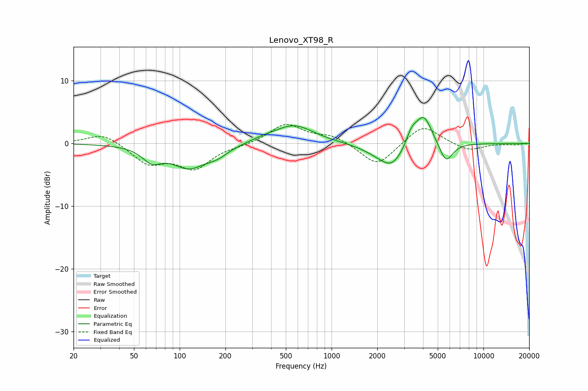

# Lenovo_XT98_R
See [usage instructions](https://github.com/jaakkopasanen/AutoEq#usage) for more options and info.

### Parametric EQs
Apply preamp of -4.2 dB when using parametric equalizer.

|   # | Type    |   Fc (Hz) |    Q |   Gain (dB) |
|-----|---------|-----------|------|-------------|
|   1 | Peaking |        66 | 2.29 |        -2.1 |
|   2 | Peaking |       115 | 1.22 |        -3.7 |
|   3 | Peaking |       178 | 1.99 |        -1.1 |
|   4 | Peaking |       353 | 1.75 |         0.4 |
|   5 | Peaking |       565 | 1.08 |         3   |
|   6 | Peaking |      1963 | 1.29 |        -0.9 |
|   7 | Peaking |      2499 | 1.76 |        -3.4 |
|   8 | Peaking |      3356 | 4.19 |         1.9 |
|   9 | Peaking |      4032 | 2.47 |         5   |
|  10 | Peaking |      5661 | 3.08 |        -3.4 |

### Fixed Band EQs
When using fixed band (also called graphic) equalizer, apply preamp of **-3.1 dB** (if available) and set gains manually with these parameters.

|   # | Type    |   Fc (Hz) |    Q |   Gain (dB) |
|-----|---------|-----------|------|-------------|
|   1 | Peaking |        31 | 1.41 |         1.8 |
|   2 | Peaking |        62 | 1.41 |        -3.1 |
|   3 | Peaking |       125 | 1.41 |        -3.8 |
|   4 | Peaking |       250 | 1.41 |        -0.3 |
|   5 | Peaking |       500 | 1.41 |         3.1 |
|   6 | Peaking |      1000 | 1.41 |         1.2 |
|   7 | Peaking |      2000 | 1.41 |        -3.7 |
|   8 | Peaking |      4000 | 1.41 |         3.1 |
|   9 | Peaking |      8000 | 1.41 |        -1.2 |
|  10 | Peaking |     16000 | 1.41 |        -0.2 |

### Graphs

