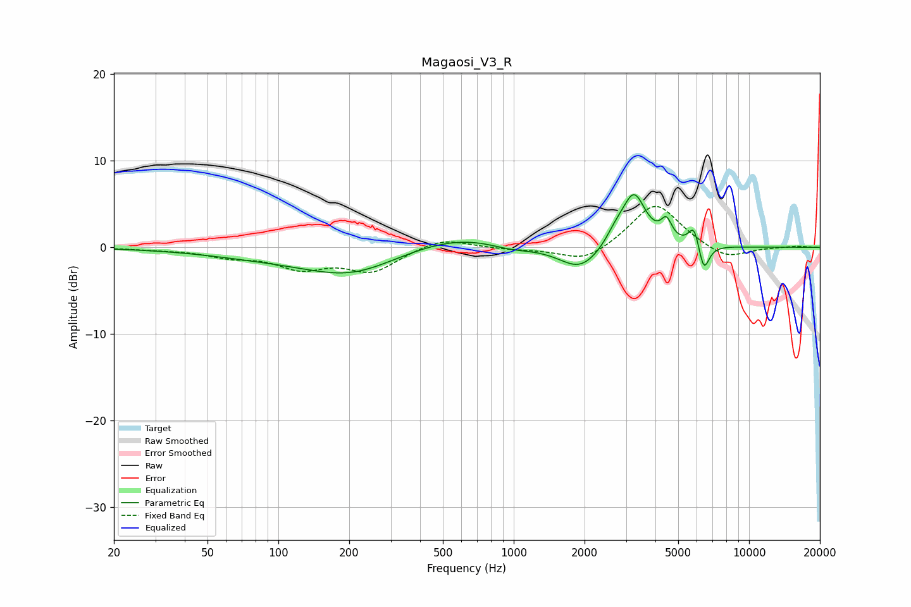

# Magaosi_V3_R
See [usage instructions](https://github.com/jaakkopasanen/AutoEq#usage) for more options and info.

### Parametric EQs
Apply preamp of -6.2 dB when using parametric equalizer.

|   # | Type    |   Fc (Hz) |    Q |   Gain (dB) |
|-----|---------|-----------|------|-------------|
|   1 | Peaking |        87 | 0.52 |        -0.9 |
|   2 | Peaking |       205 | 0.71 |        -2.9 |
|   3 | Peaking |       583 | 0.61 |         1.7 |
|   4 | Peaking |       973 | 1.43 |        -0.8 |
|   5 | Peaking |      1920 | 1.58 |        -2.9 |
|   6 | Peaking |      2701 | 3.47 |         1.2 |
|   7 | Peaking |      3240 | 2.75 |         6.1 |
|   8 | Peaking |      4454 | 6    |         2.2 |
|   9 | Peaking |      5844 | 6    |         2.6 |
|  10 | Peaking |      6418 | 6    |        -3.3 |

### Fixed Band EQs
When using fixed band (also called graphic) equalizer, apply preamp of **-4.8 dB** (if available) and set gains manually with these parameters.

|   # | Type    |   Fc (Hz) |    Q |   Gain (dB) |
|-----|---------|-----------|------|-------------|
|   1 | Peaking |        31 | 1.41 |        -0.2 |
|   2 | Peaking |        62 | 1.41 |        -0.9 |
|   3 | Peaking |       125 | 1.41 |        -2.2 |
|   4 | Peaking |       250 | 1.41 |        -2.6 |
|   5 | Peaking |       500 | 1.41 |         1.2 |
|   6 | Peaking |      1000 | 1.41 |        -0.2 |
|   7 | Peaking |      2000 | 1.41 |        -1.8 |
|   8 | Peaking |      4000 | 1.41 |         5.3 |
|   9 | Peaking |      8000 | 1.41 |        -1.5 |
|  10 | Peaking |     16000 | 1.41 |         0.2 |

### Graphs

